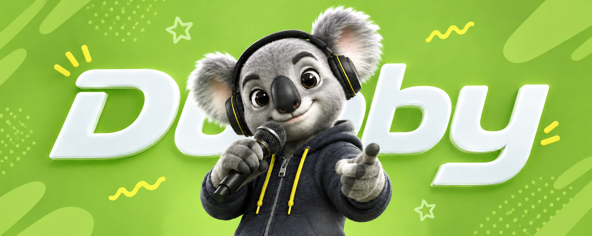
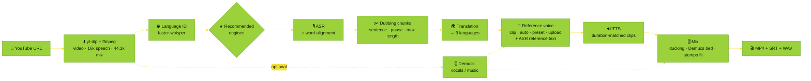

<div align="center">



<br />

<a href="https://github.com/MohammedAly22/Dubby">
  
</a>

<p>
  <b>A dubbing studio for YouTube videos.</b><br />
  It detects the spoken language, recommends the best open models for each language, gives you word-aligned transcripts and translations you can edit as they stream in, clones voices, and exports a timed dub that you review at every step.
</p>

<p>
  <a href="https://colab.research.google.com/github/MohammedAly22/Dubby/blob/main/notebooks/Dubby_Colab.ipynb"></a>
  <a href="#-installation"></a>
  <a href="#-languages--recommended-engines"></a>
  <a href="#-engines"></a>
</p>

<p>
  
  
  
  
  
  
  <a href="https://github.com/MohammedAly22/Dubby/stargazers"></a>
</p>

<p>
  <a href="#-languages--recommended-engines">Languages</a> ·
  <a href="#-features">Features</a> ·
  <a href="#-pipeline">Pipeline</a> ·
  <a href="#-engines">Engines</a> ·
  <a href="#-installation">Install</a> ·
  <a href="#%EF%B8%8F-using-the-studio">Studio</a> ·
  <a href="#-command-line">CLI</a> ·
  <a href="#%EF%B8%8F-google-colab">Colab</a> ·
  <a href="#%EF%B8%8F-architecture">Architecture</a> ·
  <a href="#-troubleshooting">Troubleshooting</a>
</p>

</div>

---

## 🌍 Languages & recommended engines

Dubby dubs **from 8 spoken languages into 9 dub languages**. Set the spoken language to **Auto-detect**: after download, faster-whisper identifies it and every stage switches to the recommended engine for that language. The ranked recommendations appear in the UI (★ Top pick), in `dubby languages`, and in the tables below.

<table>
  <tr>
    <th align="left">Language</th>
    <th align="center">Spoken</th>
    <th align="center">Dub</th>
    <th align="left">🎙️ ASR (ranked)</th>
    <th align="left">🔊 TTS (ranked)</th>
    <th align="right">OmniVoice data</th>
  </tr>
  <tr><td> <b>English</b></td><td align="center">✅</td><td align="center">✅</td><td>WhisperX › Parakeet › Qwen3-ASR › Cohere</td><td>OmniVoice › Qwen3-TTS</td><td align="right">206 k h</td></tr>
  <tr><td> <b>Arabic</b> (spoken)</td><td align="center">✅</td><td align="center">—</td><td>Cohere Arabic › QwenCleo › CohereX › Qwen3-ASR › WhisperX › Metro</td><td align="center">—</td><td align="right">—</td></tr>
  <tr><td> <b>Egyptian Arabic</b> · مصري</td><td align="center">—</td><td align="center">✅</td><td align="center">—</td><td>VoiceTut › Lahgtna › OmniVoice</td><td align="right">23 h</td></tr>
  <tr><td> <b>Modern Standard Arabic</b> · فصحى</td><td align="center">—</td><td align="center">✅</td><td align="center">—</td><td>Lahgtna › VoiceTut › OmniVoice</td><td align="right">1.5 k h</td></tr>
  <tr><td> <b>Spanish</b> · Español</td><td align="center">✅</td><td align="center">✅</td><td>Qwen3-ASR › Parakeet › Cohere › WhisperX</td><td>OmniVoice › Qwen3-TTS</td><td align="right">27.6 k h</td></tr>
  <tr><td> <b>French</b> · Français</td><td align="center">✅</td><td align="center">✅</td><td>Qwen3-ASR › Parakeet › Cohere › WhisperX</td><td>OmniVoice › Qwen3-TTS</td><td align="right">23.7 k h</td></tr>
  <tr><td> <b>Italian</b> · Italiano</td><td align="center">✅</td><td align="center">✅</td><td>Qwen3-ASR › Parakeet › Cohere › WhisperX</td><td>OmniVoice › Qwen3-TTS</td><td align="right">9.4 k h</td></tr>
  <tr><td> <b>Hindi</b> · हिन्दी</td><td align="center">✅</td><td align="center">✅</td><td>Qwen3-ASR › WhisperX</td><td><b>IndicF5</b> › OmniVoice</td><td align="right">⚠️ 117 h</td></tr>
  <tr><td> <b>Chinese</b> · 中文</td><td align="center">✅</td><td align="center">✅</td><td>Qwen3-ASR › Cohere › WhisperX</td><td>OmniVoice › Qwen3-TTS</td><td align="right">111 k h</td></tr>
  <tr><td> <b>Japanese</b> · 日本語</td><td align="center">✅</td><td align="center">✅</td><td>Qwen3-ASR › WhisperX (Kotoba-Whisper) › Cohere</td><td>OmniVoice › Qwen3-TTS</td><td align="right">37 k h</td></tr>
</table>

### 🔁 Translation recommendations

| From → To | Ranked engines | Why |
| :-- | :-- | :-- |
| English/Arabic →  Egyptian | **Emhotob-50M** › Masrawy › Jisr › LLM › NLLB | Purpose-built Egyptian translators by oddadmix |
| English/Arabic →  MSA | **Emhotob-50M** › Hunyuan-MT › Jisr › NLLB › LLM | Emhotob scores BLEU 46 on En→MSA |
| English →  Hindi | **IndicTrans2** › Hunyuan-MT › NLLB › LLM | AI4Bharat's state-of-the-art English→Indic model |
| Any →     | **Hunyuan-MT-7B** › LLM › NLLB | Hunyuan-MT won 30 of 31 WMT25 language pairs |
| Any →   | **Hunyuan-MT-7B** › Qwen LLM › NLLB | Official Chinese prompt template; Qwen is also excellent for CJK |
| Same language (e.g. en → en) | **Keep original text** | Re-voice a video without translating |

> [!NOTE]
> **How the TTS rankings were chosen.** OmniVoice publishes its training hours per language. English, Chinese, Japanese, Spanish, French and Italian all have 9k–206k hours, so OmniVoice is the top pick there: it clones voices and can generate each clip to the exact segment length. Hindi has only **117 h**, so **IndicF5** (AI4Bharat) is recommended for Hindi. Egyptian and MSA use the Arabic fine-tunes **VoiceTut** and **Lahgtna**; MSA is produced by the same checkpoints through the `arb` language id.

---

## ⚡ Quick start

<table>
  <tr>
    <td width="33%" valign="top">
      <h3>☁️ Google Colab</h3>
      No local install and a free GPU. Isolated venvs, and every cell fails loudly on errors.
      <br /><br />
      <a href="https://colab.research.google.com/github/MohammedAly22/Dubby/blob/main/notebooks/Dubby_Colab.ipynb"></a>
    </td>
    <td width="33%" valign="top">
      <h3>💻 Local studio</h3>
      Conda env with Python 3.11, Node.js 22 and ffmpeg.
      <br /><br />
      <code>./scripts/setup.sh --qwen --indic</code><br />
      <code>conda activate dubby</code><br />
      <code>dubby serve</code>
    </td>
    <td width="33%" valign="top">
      <h3>🤖 Headless</h3>
      Auto-detects the language and uses the recommended engine at each stage.
      <br /><br />
      <code>dubby dub "URL" --target ja</code><br />
      <code>dubby languages</code>
    </td>
  </tr>
</table>

---

## 🖼️ Screenshots

<table>
  <tr>
    <td width="50%"></td>
    <td width="50%"></td>
  </tr>
  <tr>
    <td align="center"><sub>🌙 Dark mode</sub></td>
    <td align="center"><sub>☀️ Light mode</sub></td>
  </tr>
  <tr>
    <td colspan="2"></td>
  </tr>
  <tr>
    <td colspan="2" align="center"><sub>🎬 Project workspace: player with subtitles, timeline with source and dub lanes, and one panel per stage</sub></td>
  </tr>
</table>

---

## ✨ Features

<table>
  <tr>
    <td width="33%" valign="top">
      <h4>🌐 Language auto-detection</h4>
      faster-whisper votes over several speech windows after download, then sets the spoken language and the recommended engines.
    </td>
    <td width="33%" valign="top">
      <h4>★ Per-language recommendations</h4>
      Ranked engines for every stage and language pair, each with a reason. Click <i>Use recommended</i> to apply one, and changing a language re-picks the stages that depend on it.
    </td>
    <td width="33%" valign="top">
      <h4>🎙️ Word-aligned transcripts</h4>
      Qwen3 forced aligner or wav2vec2 per language. Chinese and Japanese are aligned per character. Click a word to seek, and split, merge or edit chunks.
    </td>
  </tr>
  <tr>
    <td valign="top">
      <h4>🌍 Streaming translation</h4>
      Hunyuan-MT, NLLB-200, IndicTrans2, oddadmix Egyptian models, or a context-aware LLM. Each line appears as soon as it is ready.
    </td>
    <td valign="top">
      <h4>🧬 Voice cloning + auto reference text</h4>
      Clone from a range of the video, per segment, from an upload, or from a studio voice. Uploaded or clipped references are <b>transcribed with any ASR engine</b> to use as the TTS reference text.
    </td>
    <td valign="top">
      <h4>🔊 Async TTS with review</h4>
      OmniVoice, Qwen3-TTS, IndicF5, VoiceTut or Lahgtna. Listen as clips arrive, fix lines (with a tashkeel bar for Arabic) and regenerate just that line.
    </td>
  </tr>
  <tr>
    <td valign="top">
      <h4>⏱️ Timing</h4>
      OmniVoice generates each clip to its segment's duration. At render, clips that overflow their slot are sped up with pitch-preserving <code>atempo</code>, then trimmed.
    </td>
    <td valign="top">
      <h4>👀 Preview before rendering</h4>
      <i>Dub preview</i> plays the clips in sync over the video. <i>Rendered</i> plays the final mix with embedded subtitles.
    </td>
    <td valign="top">
      <h4>🧠 Isolated model workers</h4>
      Four engine families (core, qwen, nemo, indic), each in its own interpreter, so incompatible transformers versions coexist. Stopping a family frees its VRAM, and cancel kills its worker process.
    </td>
  </tr>
  <tr>
    <td valign="top">
      <h4>🎨 Studio UI</h4>
      Black & white UI with light and dark themes, an animated background, dropdowns with real flags, and a live logs drawer.
    </td>
    <td valign="top">
      <h4>📟 Readable terminal</h4>
      Rich stage banners, progress bars, detected language, live transcripts and translations, and clip-fit reports.
    </td>
    <td valign="top">
      <h4>💾 Saved progress</h4>
      Every project, stage, edit and clip is saved to disk, so an interrupted studio resumes where it left off.
    </td>
  </tr>
</table>

---

## 🧭 Pipeline



> [!TIP]
> You can review and edit between every step, and nothing runs until you start it. Fix a word, retranslate a line or re-transcribe the reference, then regenerate only that clip.

---

## 🧩 Engines

### 🎙️ Speech recognition

| Engine | ID | Family | Spoken languages | Word timings | Highlights |
| :-- | :-- | :-: | :-- | :-- | :-- |
| **WhisperX** | `whisperx` | core | en ar es fr it hi zh ja | wav2vec2 per language | Batched faster-whisper, plus a Kotoba-Whisper option for Japanese |
| **Qwen3-ASR** | `qwen3-asr` | qwen | en ar es fr it hi zh ja | Qwen3-ForcedAligner (en zh ja es fr it) / wav2vec2 | SOTA open ASR (1.7B / 0.6B) |
| **NVIDIA Parakeet TDT** | `parakeet` | nemo | en es fr it | native | Fastest ASR, 25 European languages |
| **Cohere Transcribe** | `cohere-transcribe` | core | en ar es fr it zh ja | wav2vec2 | 🔒 gated · Open ASR leaderboard #1 at release |
| **Cohere Transcribe Arabic** | `cohere-transcribe-arabic` | core | ar en | wav2vec2 |  dialects + code-switching · 🔒 |
| **CohereX** | `coherex` | core | ar en es fr it zh ja | wav2vec2 | VAD → Cohere → alignment · 🔒 |
| **QwenCleo-ASR** | `qwencleo` | qwen | ar | wav2vec2 |  SOTA Egyptian + code-switching |
| **Metro-ASR** | `metro-asr` | core | ar | wav2vec2 |  61.6M CTC, fast on CPU |
| **Whisper language ID** | `whisper-langid` | core | 99 languages | — | Detects the spoken language |

### 🌍 Translation

| Engine | ID | Family | Directions | Highlights |
| :-- | :-- | :-: | :-- | :-- |
| **Tencent Hunyuan-MT-7B** | `hunyuan-mt` | core | any → en es fr it hi zh ja arb | [WMT25 winner](https://huggingface.co/tencent/Hunyuan-MT-7B), official prompt templates |
| **Meta NLLB-200** | `nllb` | core | any → all 9 (incl. `arz_Arab`) | [600M / 1.3B / 3.3B](https://huggingface.co/facebook/nllb-200-distilled-1.3B), fast batched |
| **AI4Bharat IndicTrans2** | `indictrans2` | indic | en → hi | [SOTA English→Indic](https://huggingface.co/ai4bharat/indictrans2-en-indic-1B) · 🔒 |
| **oddadmix Emhotob-50M** | `emhotob` | core | en/ar → arz · arb | [Egyptian](https://huggingface.co/oddadmix/50M-Egyptian-Translation-v1) · [MSA](https://huggingface.co/oddadmix/50M-English-MSA-v1) · [MSA↔Egyptian](https://huggingface.co/oddadmix/50M-MSA-Egyptian-v1) |
| **oddadmix Masrawy v2** | `masrawy` | core | en → arz | [chrF 66.7](https://huggingface.co/oddadmix/masrawy-english-arabic-translator-v2) |
| **oddadmix Jisr-MT-50M** | `jisr` | core | en → arz · arb | [Multi-dialect Marian](https://huggingface.co/oddadmix/Jisr-MT-50M-AllDialects) |
| **Instruct LLM** | `llm` | core | any → any | Qwen3 instruct with context from previous lines and a spoken-length target |
| **Keep original text** | `passthrough` | core | same language | Re-voice without translating |

### 🔊 Text-to-speech

| Engine | ID | Family | Dub languages | Duration control | Highlights |
| :-- | :-- | :-: | :-- | :-: | :-- |
| **OmniVoice** | `omnivoice` | core | all 9 | ✅ | [646 languages](https://huggingface.co/k2-fsa/OmniVoice), zero-shot cloning |
| **Qwen3-TTS** | `qwen3-tts` | qwen | en zh ja es fr it | fitted at render | [Expressive cloning](https://huggingface.co/Qwen/Qwen3-TTS-12Hz-1.7B-Base), 1.7B / 0.6B |
| **AI4Bharat IndicF5** | `indicf5` | indic | hi | fitted at render | [Natural Hindi cloning](https://huggingface.co/ai4bharat/IndicF5) · 🔒 |
| **VoiceTut-TTS** | `voicetut` | core | arz · arb | ✅ | [380 h of Egyptian podcasts](https://huggingface.co/mohammedaly22/VoiceTut-TTS), 17 studio voices |
| **Lahgtna OmniVoice v2** | `lahgtna-omnivoice` | core | arz · arb | ✅ | [13 Arabic dialects](https://huggingface.co/oddadmix/lahgtna-omnivoice-v2), diacritics-aware |

> [!IMPORTANT]
> **Reference voice language matters.** Voice cloning copies the accent of the reference clip. For natural Spanish, Chinese and other dubs, use *From this video*, *Auto per segment* or an uploaded recording in the dub language. The built-in studio voices are Egyptian Arabic.

---

## 🚀 Installation

**Prerequisites:** 🐍 [Miniconda](https://docs.conda.io/en/latest/miniconda.html) · 🎮 an NVIDIA GPU (a T4 16 GB runs every family, one at a time; Hunyuan-MT-7B is best on L4/A100) · 🔑 a [Hugging Face token](https://huggingface.co/settings/tokens) for gated models

### One-command setup

```bash
git clone https://github.com/MohammedAly22/Dubby && cd Dubby

# Linux / macOS
./scripts/setup.sh --qwen --indic        # add --nemo for Parakeet, --cpu for CPU-only wheels

# Windows (PowerShell)
.\scripts\setup.ps1 -Qwen -Indic         # -Nemo, -Cpu
```

<details>
<summary><b>🛠️ Manual setup (step by step)</b></summary>

```bash
# 1) main env: Python 3.11 + Node.js 22 + ffmpeg + core engines
conda env create -f environment.yml
conda activate dubby

# 2) (optional) qwen family: Qwen3-ASR, QwenCleo-ASR, Qwen3-TTS  (transformers 4.57)
conda env create -f environment-qwen.yml
conda run -n dubby-qwen pip install qwencleo-asr --no-deps
conda run -n dubby-qwen pip install qwen-tts --no-deps
conda run -n dubby-qwen pip install onnxruntime einops sox

# 3) (optional) nemo family: NVIDIA Parakeet
conda env create -f environment-nemo.yml

# 4) (optional) indic family: IndicTrans2 + IndicF5 for Hindi  (transformers < 4.50)
conda env create -f environment-indic.yml
conda run -n dubby-indic pip install "git+https://github.com/ai4bharat/IndicF5.git" "transformers<4.50"

# 5) (optional) Demucs vocal separation, in the main env
pip install demucs

# 6) build the UI with Node and check everything
dubby build-ui
dubby doctor
dubby languages
```

Dubby **auto-detects** the sibling envs `dubby-qwen`, `dubby-nemo` and `dubby-indic`. You can also point a family at any interpreter from ⚙️ Settings, or with `DUBBY_PYTHON_<FAMILY>=/path/to/python`.

</details>

---

## 🎛️ Using the studio

```bash
conda activate dubby
dubby serve              # http://127.0.0.1:8765 opens automatically
```

| Step | What you do |
| :-: | :-- |
| **1 · ⬇️ Source** | Paste a YouTube link (or upload a file). Leave the spoken language on **🌐 Auto-detect** and pick a dub language. After download, the detected language and its confidence appear, and the recommended engines are applied |
| **2 · 🎙️ Transcribe** | The recommended engine is preselected (★ Top pick). Chunks stream in with word timings: click a word to seek, ✂️ split, and merge or delete |
| **3 · 🌍 Translate** | Rows fill in one by one while you edit. A *source edited* badge flags stale lines, and ↻ retranslates one line |
| **4 · 🧬 Voice** | *From this video* · *Auto per segment* · *Studio voice* · *Upload*. Clipped and uploaded references are **transcribed with the ASR engine you choose** to become the TTS reference text |
| **5 · 🔊 Dub** | *Generate all* runs asynchronously. Listen as clips land, check the fit bar, fix lines (tashkeel bar for Arabic), ↻ regenerate, and use **Dub preview** on the video |
| **6 · 🎬 Export** | Set the mix (ducked original / music stem / silent, levels, max speed-up, subtitles), **Render**, then download or **Export** to disk |

Every action also streams to the **terminal** and the **📟 Logs** drawer.

---

## 🤖 Command line

```bash
dubby serve [--host 0.0.0.0] [--port 8765] [--no-open] [-v]   # web studio
dubby dev [--port 8765]                                        # backend + Vite dev UI (hot reload) on :5173
dubby dub URL [options]                                        # full pipeline, no UI
dubby languages                                                # languages + ranked engine recommendations
dubby doctor                                                   # tools, interpreters, engine availability
dubby engines                                                  # engine catalogue
dubby projects                                                 # saved projects
dubby build-ui                                                 # npm ci && vite build
```

<details>
<summary><b>🎯 Headless examples</b></summary>

```bash
# auto-detect the spoken language, recommended engines everywhere
dubby dub "https://www.youtube.com/watch?v=VIDEO" --target ja --voice auto

# English → Hindi with explicit engines
dubby dub "URL" --source en --target hi --asr qwen3-asr --translation indictrans2 --tts indicf5 --voice auto

# English → Egyptian Arabic with a studio voice
dubby dub "URL" --source en --target arz --tts voicetut --voice preset:Mohamed --export ~/Videos/Dubbed
```

`--source` accepts `auto` or `en ar es fr it hi zh ja`. `--target` accepts `arz arb en es fr it hi zh ja`. `--voice` accepts `preset:NAME`, `auto`, `clip:START-END` or `file:PATH` (with `--ref-text`). Engines you don't pass use the recommended ones.

</details>

---

## ☁️ Google Colab

<a href="https://colab.research.google.com/github/MohammedAly22/Dubby/blob/main/notebooks/Dubby_Colab.ipynb"></a>

Run [`notebooks/Dubby_Colab.ipynb`](notebooks/Dubby_Colab.ipynb) cell by cell:

`0 helpers` → `1 GPU` → `2 clone` → `3 Node.js 22` → `4 core venv` → `5 qwen / nemo / indic venvs` → `6 HF token` → `7 build UI + doctor + languages` → `🚀 launch`

* Dubby installs with **`uv` into isolated Python 3.12 venvs** under `/content/envs`, so Colab's own Python 3.13 packages never conflict with it.
* Every install step **stops with the real error**. You never see a ✅ on a failed install, and the venv's `dubby` is added to `PATH` for later cells.
* The launch cell gives you a **Colab proxy** or **Cloudflare tunnel** link. Another cell tails the studio terminal, and you can export straight to Google Drive.

---

## ⚙️ Configuration

Settings live in `~/Dubby/settings.json` and can be edited in the UI. Environment variables override them:

| Variable | Meaning |
| :-- | :-- |
| `DUBBY_HOME` | Projects, cache and exports root (default `~/Dubby`) |
| `DUBBY_HOST` · `DUBBY_PORT` | Server bind address |
| `DUBBY_DEVICE` | `auto` · `cuda` · `cpu` |
| `DUBBY_PYTHON_CORE` · `_QWEN` · `_NEMO` · `_INDIC` | Interpreter per engine family |
| `HF_TOKEN` | Hugging Face token passed to workers |

### ▶️ YouTube downloads on Colab & cloud machines (no sign-in)

Cloud IPs (Colab, VMs) are often answered with *"Sign in to confirm you're not a bot"*. Dubby handles this for you, with no cookies and no account:

1. 🔐 **Automatic PO tokens.** Dubby builds and runs the [bgutil PO-token provider](https://github.com/Brainicism/bgutil-ytdlp-pot-provider), recommended in yt-dlp's [PO Token Guide](https://github.com/yt-dlp/yt-dlp/wiki/PO-Token-Guide). It is built once (`dubby youtube-helper`, ~1 min — the Colab install cell does it) and then starts with the studio.
2. 📺 **Client fallback.** If YouTube still blocks a request, Dubby retries through the TV, embedded and Safari player clients over IPv4, which YouTube scores differently.
3. 📁 **One-drop fallback.** If every strategy is blocked, drop the video file on the Source step — the project keeps its languages and engines.

> [!TIP]
> Still blocked? A fresh Colab runtime usually gets a new IP. A proxy (⚙️ Settings) and a cookies file are supported but optional — cookies are only really needed for members-only or age-restricted videos.

---

## 🏗️ Architecture

```
dubby/
├── cli.py                 # rich CLI: serve · dev · dub · languages · doctor · engines · projects · build-ui
├── config.py              # settings + per-family interpreter discovery (core · qwen · nemo · indic)
├── languages.py           # language registry: ISO / OmniVoice / NLLB / Qwen ids, scripts, OmniVoice hours
├── recommend.py           # ranked engine recommendations per stage and language pair
├── schemas.py             # Project / Segment / Word / TTSState … (pydantic, shared with the UI)
├── core/
│   ├── studio.py          # orchestration: detection, stages, edits, voices, render, export
│   ├── jobs.py            # GPU job queue + worker process manager (+ doctor runner)
│   ├── storage.py         # atomic project.json store with debounced autosave
│   ├── events.py          # thread-safe bus → terminal reporter + websockets
│   ├── reporter.py        # rich terminal output
│   └── voices.py          # preset voices, reference clip cutting
├── workers/               # JSON-lines protocol · worker loop (asr · asr_ref · langid · translation · tts) · doctor
├── engines/
│   ├── asr/               # whisperx · qwen (Qwen3 + QwenCleo) · cohere · coherex · parakeet · metro · common
│   ├── translation/       # hunyuan · nllb · indictrans2 · emhotob · masrawy · jisr · llm · passthrough
│   ├── tts/               # omnivoice_base · omnivoice · qwen3_tts · indicf5 · voicetut · lahgtna
│   ├── langid/            # whisper_langid
│   └── separation/        # demucs
├── pipeline/              # chunking (script-aware) · render (mix + fit + mux) · subtitles
├── media/                 # youtube (yt-dlp) · ffmpeg wrappers
├── server/app.py          # FastAPI REST + websocket + range-enabled media + SPA
└── web/dist/              # built UI (from ui/)
ui/                        # React + TypeScript + Tailwind v4 source
assets/                    # banner, flags, screenshots
notebooks/Dubby_Colab.ipynb
```

**Why worker processes?** The studio process never imports a model. Each engine family gets one long-lived worker that keeps its model loaded, so regenerating one clip is fast. The families pin different `transformers` versions (5.x core, 4.57 qwen, < 4.50 indic), and separate interpreters let them coexist. With *exclusive GPU* on, starting a job in one family first stops the others so their VRAM is released.

<details>
<summary><b>➕ Adding an engine or a language</b></summary>

1. **Engine:** subclass `ASREngine`, `TranslationEngine` or `TTSEngine`, declare `EngineInfo` (languages, family, requires, params), and register it in `engines/registry.py`.
2. **Language:** add a `Language(...)` entry in `dubby/languages.py` with its ISO / OmniVoice / NLLB / Qwen ids, then add ranked entries in `dubby/recommend.py`, a flag in `assets/`, and a `LANGS` entry in `ui/src/components/Flags.tsx`.

```python
# dubby/engines/tts/my_tts.py
from dubby.engines.base import EngineInfo, ParamSpec, TTSEngine

class MyTTS(TTSEngine):
    info = EngineInfo(id="my-tts", kind="tts", name="My TTS", family="core",
                      targets=["es", "fr"], requires=["my_tts"], install="pip install my-tts",
                      params=[ParamSpec("speed", "Speed", "number", 1.0, min=0.5, max=2, step=0.05)])
    load_params = ("model",)

    def load(self, ctx):              # heavy imports go inside methods
        import my_tts
        self.model = my_tts.load(device=self.device)

    def synthesize(self, items, target, ctx):
        import soundfile as sf
        for it in items:
            wav, sr = self.model.speak(it.text, ref=it.ref_audio, ref_text=it.ref_text, seconds=it.duration)
            sf.write(it.out_path, wav, sr)
            yield it, len(wav) / sr
```

</details>

---

## 🩺 Troubleshooting

| Symptom | Fix |
| :-- | :-- |
| Engine shows **not installed** | `dubby doctor` prints the exact `pip install …` for the right family interpreter |
| **Worker exited unexpectedly** | Usually out of GPU memory. Lower batch sizes, pick a smaller checkpoint (NLLB 600M, Qwen3-ASR 0.6B), or keep *exclusive GPU* on |
| 401/403 on Cohere, IndicF5 or IndicTrans2 | Accept the model terms on Hugging Face and add your token in Settings |
| Wrong spoken language detected | Pick it manually in the Source step. The engines re-pick automatically |
| Dub has a foreign accent | Use a reference voice in the dub language (clip, upload or auto) instead of an Egyptian studio voice |
| Weak Hindi pronunciation | Use IndicF5 (indic family) instead of OmniVoice, which has only 117 h of Hindi |
| Colab: `dubby: command not found` | Re-run step 4. It installs into `/content/envs/dubby` and adds it to `PATH`, and it stops with the real error if the install fails |
| *Sign in to confirm you're not a bot* / *blocked by YouTube* | Handled automatically ([see above](#️-youtube-downloads-on-colab--cloud-machines-no-sign-in)) — if every strategy fails, drop the video file on the Source step, or restart the Colab runtime for a new IP |
| `youtube token helper: not built` in `dubby doctor` | Run `dubby youtube-helper --check` (needs `node` ≥ 20, `npm` and `git`), and keep tooling current: `pip install -U "yt-dlp[default]" bgutil-ytdlp-pot-provider` |
| `Could not resolve host: github.com` | Your network is blocking GitHub's DNS. Use another network or ask your admin |
| Dev UI shows *backend not reachable* | Start `dubby serve`, or run `dubby dev` to launch the backend and Vite together |
| Clips sound rushed | Lower *Max speed-up*, shorten the line, or raise *Max chunk* |
| Mispronounced names | Rephrase the line (for Arabic, add tashkeel with the diacritics bar) and regenerate it |

---

## 🙏 Credits

Dubby builds on these open-source projects:

[WhisperX](https://github.com/m-bain/whisperX) ·
[faster-whisper](https://github.com/SYSTRAN/faster-whisper) ·
[Qwen3-ASR](https://github.com/QwenLM/Qwen3-ASR) ·
[Qwen3-TTS](https://github.com/QwenLM/Qwen3-TTS) ·
[Cohere Transcribe](https://huggingface.co/CohereLabs/cohere-transcribe-arabic-07-2026) ·
[CohereX](https://github.com/bakrianoo/cohereX) ·
[NVIDIA NeMo](https://github.com/NVIDIA/NeMo) ·
[QwenCleo-ASR](https://github.com/MohammedAly22/qwencleo-asr) ·
[Metro-ASR](https://github.com/MohammedAly22/metro-asr) ·
[Hunyuan-MT](https://huggingface.co/tencent/Hunyuan-MT-7B) ·
[NLLB-200](https://huggingface.co/facebook/nllb-200-distilled-1.3B) ·
[IndicTrans2](https://github.com/AI4Bharat/IndicTrans2) ·
[IndicF5](https://github.com/AI4Bharat/IndicF5) ·
[oddadmix models](https://huggingface.co/oddadmix) ·
[OmniVoice](https://github.com/k2-fsa/OmniVoice) ·
[VoiceTut-TTS](https://github.com/MohammedAly22/VoiceTuT-TTS) ·
[Demucs](https://github.com/adefossez/demucs) ·
[yt-dlp](https://github.com/yt-dlp/yt-dlp) ·
[Silero VAD](https://github.com/snakers4/silero-vad) ·
flags from [flagcdn](https://flagcdn.com)

Each model keeps its own license. Check them before commercial use.

> [!WARNING]
> **Responsible use:** only dub content you have the rights to, get consent before cloning a real person's voice, and never use Dubby to impersonate or mislead.

<div align="center">

<br />

<sub>Made with 💚 & 💛 for creators everywhere · <b>Dubby 🐨</b></sub>

</div>
