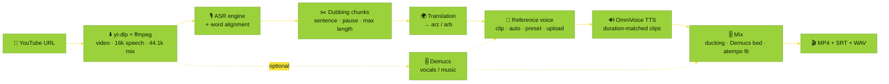

<div align="center">


<br />

<a href="https://github.com/MohammedAly22/Dubby">
  
</a>

<p>
  <b>A studio for dubbing YouTube videos into Arabic.</b><br />
  Word-aligned transcripts, translations you can edit as they stream in, cloned voices, and a timed export you review at every step.
</p>

<p>
  <a href="https://colab.research.google.com/github/MohammedAly22/Dubby/blob/main/notebooks/Dubby_Colab.ipynb"></a>
  <a href="#-installation"></a>
  <a href="#-engines"></a>
</p>

<p>
  
  
  
  
  
  
  <a href="https://github.com/MohammedAly22/Dubby/stargazers"></a>
</p>

<p>
  <a href="#-features">Features</a> ·
  <a href="#-pipeline">Pipeline</a> ·
  <a href="#-engines">Engines</a> ·
  <a href="#-installation">Install</a> ·
  <a href="#%EF%B8%8F-using-the-studio">Studio</a> ·
  <a href="#-command-line">CLI</a> ·
  <a href="#%EF%B8%8F-google-colab">Colab</a> ·
  <a href="#%EF%B8%8F-architecture">Architecture</a> ·
  <a href="#-troubleshooting">Troubleshooting</a>
</p>

</div>

---

## 🌍 Languages

<table align="center">
  <tr>
    <th align="center">From</th>
    <th></th>
    <th align="center">To</th>
  </tr>
  <tr>
    <td align="center"><br /><b>English</b></td>
    <td align="center" rowspan="2">➜</td>
    <td align="center"><br /><b>Egyptian Arabic</b> · مصري<br /><sub>OmniVoice language id <code>arz</code></sub></td>
  </tr>
  <tr>
    <td align="center"><br /><b>Arabic</b> · عربي<br /><sub>Egyptian or MSA speech</sub></td>
    <td align="center"><br /><b>Modern Standard Arabic</b> · فصحى<br /><sub>OmniVoice language id <code>arb</code></sub></td>
  </tr>
</table>

---

## ⚡ Quick start

<table>
  <tr>
    <td width="33%" valign="top">
      <h3>☁️ Google Colab</h3>
      No local install and a free GPU. Run the notebook cells in order and open the studio link.
      <br /><br />
      <a href="https://colab.research.google.com/github/MohammedAly22/Dubby/blob/main/notebooks/Dubby_Colab.ipynb"></a>
    </td>
    <td width="33%" valign="top">
      <h3>💻 Local studio</h3>
      Conda env with Python 3.11, Node.js 22 and ffmpeg.
      <br /><br />
      <code>./scripts/setup.sh --qwen</code><br />
      <code>conda activate dubby</code><br />
      <code>dubby serve</code>
    </td>
    <td width="33%" valign="top">
      <h3>🤖 Headless</h3>
      The same pipeline from a single command, with rich terminal output.
      <br /><br />
      <code>dubby dub "URL" --target arz</code><br />
      <code>--tts voicetut --voice auto</code>
    </td>
  </tr>
</table>

---

## 🖼️ Screenshots

<table>
  <tr>
    <td width="50%"></td>
    <td width="50%"></td>
  </tr>
  <tr>
    <td align="center"><sub>🌙 Dark mode</sub></td>
    <td align="center"><sub>☀️ Light mode</sub></td>
  </tr>
  <tr>
    <td colspan="2"></td>
  </tr>
  <tr>
    <td colspan="2" align="center"><sub>🎬 Project workspace: player with captions, timeline with source and dub lanes, and one panel per stage</sub></td>
  </tr>
</table>

---

## ✨ Features

<table>
  <tr>
    <td width="33%" valign="top">
      <h4>🎬 YouTube in, dubbed MP4 out</h4>
      yt-dlp uses Node.js to pass YouTube's JS challenges. You get a timed Arabic dub, embedded subtitles and WAV stems.
    </td>
    <td width="33%" valign="top">
      <h4>🧩 Pluggable engines</h4>
      8 ASR, 4 translation and 2 TTS engines, plus Demucs separation. Adding a new engine takes one class.
    </td>
    <td width="33%" valign="top">
      <h4>🎙️ Word-aligned transcripts</h4>
      Words light up while the video plays. Click one to seek, and edit, split, merge or delete chunks.
    </td>
  </tr>
  <tr>
    <td valign="top">
      <h4>🌍 Streaming translation</h4>
      Each translated chunk shows up as soon as it is ready. Edit lines or retranslate a single one.
    </td>
    <td valign="top">
      <h4>🧬 Voice cloning</h4>
      Clone from a range of the video, per chunk for multi-speaker videos, from an upload, or from 17 studio voices.
    </td>
    <td valign="top">
      <h4>🔊 Async TTS with review</h4>
      Listen as clips arrive, add tashkeel from the diacritics bar, and regenerate stale lines. A fit bar shows each clip against its slot.
    </td>
  </tr>
  <tr>
    <td valign="top">
      <h4>⏱️ Timing</h4>
      OmniVoice generates each clip to its segment's duration. At render, overflowing clips are sped up with pitch-preserving <code>atempo</code>.
    </td>
    <td valign="top">
      <h4>👀 Preview before rendering</h4>
      <i>Dub preview</i> plays the clips in sync over the original video. <i>Rendered</i> plays the final mix.
    </td>
    <td valign="top">
      <h4>🧠 Isolated model workers</h4>
      One subprocess per engine family, each with its own interpreter if needed. Stopping a family frees its VRAM, and cancel kills the process.
    </td>
  </tr>
  <tr>
    <td valign="top">
      <h4>🎨 Studio UI</h4>
      Light and dark themes, lime and yellow accents, an animated background, dropdowns with real flags, and a live logs drawer.
    </td>
    <td valign="top">
      <h4>📟 Readable terminal</h4>
      Rich stage banners, progress bars, live transcripts and translations, and clip-fit reports.
    </td>
    <td valign="top">
      <h4>💾 Saved progress</h4>
      Every project, stage, edit and clip is saved to disk, so an interrupted studio resumes where it left off.
    </td>
  </tr>
</table>

---

## 🧭 Pipeline



> [!TIP]
> You can review and edit between every step, and nothing runs until you start it. Fix a word, retranslate a line, add diacritics, then regenerate only that clip.

---

## 🧩 Engines

### 🎙️ Speech recognition

| Engine | ID | Family | Languages | Word timings | Highlights |
| :-- | :-- | :-: | :-: | :-- | :-- |
| **WhisperX** | `whisperx` | core | en · ar | wav2vec2 forced alignment | Default for English, batched faster-whisper |
| **NVIDIA Parakeet TDT** | `parakeet` | nemo | en | native | Fastest English ASR (0.6B) |
| **Qwen3-ASR** | `qwen3-asr` | qwen | en · ar | Qwen3-ForcedAligner / wav2vec2 | SOTA open ASR (1.7B / 0.6B) |
| **Cohere Transcribe** | `cohere-transcribe` | core | en · ar | wav2vec2 | 🔒 gated |
| **Cohere Transcribe Arabic** | `cohere-transcribe-arabic` | core | ar · en | wav2vec2 |  dialects + code-switching · 🔒 gated |
| **CohereX** | `coherex` | core | ar · en | wav2vec2 |  VAD → Cohere → alignment · 🔒 gated |
| **QwenCleo-ASR** | `qwencleo` | qwen | ar | wav2vec2 |  SOTA Egyptian + code-switching |
| **Metro-ASR** | `metro-asr` | core | ar | wav2vec2 |  61.6M CTC, fast on CPU, optional KenLM |

### 🌍 Translation

| Engine | ID | Directions | Highlights |
| :-- | :-- | :-- | :-- |
| **oddadmix Emhotob-50M** | `emhotob` | en→arz · en→arb · ar→arb · ar→arz | [Egyptian](https://huggingface.co/oddadmix/50M-Egyptian-Translation-v1) · [MSA](https://huggingface.co/oddadmix/50M-English-MSA-v1) (BLEU 46) · [MSA↔Egyptian](https://huggingface.co/oddadmix/50M-MSA-Egyptian-v1) |
| **oddadmix Jisr-MT-50M** | `jisr` | en→arz · en→arb | [Jisr-MT-50M-AllDialects](https://huggingface.co/oddadmix/Jisr-MT-50M-AllDialects): Marian with dialect tags |
| **oddadmix Masrawy v2** | `masrawy` | en→arz | [masrawy-english-arabic-translator-v2](https://huggingface.co/oddadmix/masrawy-english-arabic-translator-v2) (chrF 66.7) |
| **Instruct LLM** | `llm` | en/ar → arz/arb | Any chat model (default Qwen3-4B-Instruct-2507), using previous lines as context |

### 🔊 Text-to-speech · OmniVoice family

| Engine | ID |  Egyptian |  MSA | Highlights |
| :-- | :-- | :-: | :-: | :-- |
| **VoiceTut-TTS** | `voicetut` | ✅ `arz` | ✅ `arb` | [380 h of Egyptian podcasts](https://huggingface.co/mohammedaly22/VoiceTut-TTS), code-switching, 17 voices |
| **Lahgtna OmniVoice v2** | `lahgtna-omnivoice` | ✅ `arz` | ✅ `arb` | [13 Arabic dialects](https://huggingface.co/oddadmix/lahgtna-omnivoice-v2), benefits from diacritics |

> [!NOTE]
> MSA comes from the **same checkpoints**. Dubby only switches the OmniVoice language id from `arz` to `arb`, so no extra model is needed.

---

## 🚀 Installation

**Prerequisites:** 🐍 [Miniconda](https://docs.conda.io/en/latest/miniconda.html) · 🎮 an NVIDIA GPU is recommended (a T4 16 GB runs every family, one at a time; CPU works for short clips) · 🔑 a [Hugging Face token](https://huggingface.co/settings/tokens) for the gated Cohere engines

### One-command setup

```bash
git clone https://github.com/MohammedAly22/Dubby && cd Dubby

# Linux / macOS
./scripts/setup.sh --qwen          # add --nemo for Parakeet, --cpu for CPU-only wheels

# Windows (PowerShell)
.\scripts\setup.ps1 -Qwen          # -Nemo, -Cpu
```

<details>
<summary><b>🛠️ Manual setup (step by step)</b></summary>

```bash
# 1) main env: Python 3.11 + Node.js 22 + ffmpeg + core engines
conda env create -f environment.yml
conda activate dubby

# 2) (optional) Qwen3-ASR / QwenCleo-ASR — separate env because qwen-asr pins transformers 4.57
conda env create -f environment-qwen.yml
conda run -n dubby-qwen pip install qwencleo-asr --no-deps

# 3) (optional) NVIDIA Parakeet
conda env create -f environment-nemo.yml

# 4) (optional) Demucs vocal separation, in the main env
pip install demucs

# 5) build the UI with Node and check everything
dubby build-ui
dubby doctor
```

Dubby **auto-detects** the sibling envs `dubby-qwen` and `dubby-nemo`. You can also point a family at any interpreter from ⚙️ Settings, or with `DUBBY_PYTHON_QWEN=/path/to/python`.

</details>

---

## 🎛️ Using the studio

```bash
conda activate dubby
dubby serve              # http://127.0.0.1:8765 opens automatically
```

| Step | What you do |
| :-: | :-- |
| **1 · ⬇️ Source** | Paste a YouTube link (or upload a file), then pick  English or  Arabic →  مصري or  فصحى |
| **2 · 🎙️ Transcribe** | Choose an engine and watch chunks stream in. Click a word to seek, ✂️ split before a word, merge or delete chunks, and tune the chunk rules |
| **3 · 🌍 Translate** | Rows fill in one by one while you edit. A *source edited* badge flags stale lines, and ↻ retranslates one line |
| **4 · 🧬 Voice** | *From this video* (3–12 s clip) · *Auto per segment* · *Studio voice* · *Upload*, plus optional **Demucs** |
| **5 · 🔊 Dub** | *Generate all* runs asynchronously. Listen as clips land, check the fit bar, add tashkeel, ↻ regenerate, and use **Dub preview** on the video |
| **6 · 🎬 Export** | Set the mix (ducked original / music stem / silent, levels, max speed-up, subtitles), **Render**, then download or **Export** to disk |

Every action also streams to the **terminal** and the **📟 Logs** drawer. Use the ☀️/🌙 switch in the top bar to change themes.

---

## 🤖 Command line

```bash
dubby serve [--host 0.0.0.0] [--port 8765] [--no-open] [-v]   # web studio
dubby dev [--port 8765]                                        # backend + Vite dev UI (hot reload) on :5173
dubby dub URL [options]                                        # full pipeline, no UI
dubby doctor                                                   # tools, interpreters, engine availability
dubby engines                                                  # engine catalogue
dubby projects                                                 # saved projects
dubby build-ui                                                 # npm ci && vite build
```

<details>
<summary><b>🎯 Headless example</b></summary>

```bash
dubby dub "https://www.youtube.com/watch?v=VIDEO" \
  --source en --target arz \
  --asr whisperx --asr-param model=large-v3-turbo \
  --translation emhotob \
  --tts voicetut --tts-param num_step=32 \
  --voice auto \
  --export ~/Videos/Dubbed
```

`--voice` accepts `preset:NAME`, `auto`, `clip:START-END` (seconds) or `file:PATH` (with `--ref-text`).

</details>

---

## ☁️ Google Colab

<a href="https://colab.research.google.com/github/MohammedAly22/Dubby/blob/main/notebooks/Dubby_Colab.ipynb"></a>

Run [`notebooks/Dubby_Colab.ipynb`](notebooks/Dubby_Colab.ipynb) cell by cell:

`1 GPU check` → `2 clone` → `3 Node.js 22` → `4 core engines` → `5 optional Qwen/NeMo venvs` → `6 HF token` → `7 build UI` → `🚀 launch`

The launch cell gives you a **Colab proxy** link or a public **Cloudflare tunnel** link. Another cell tails the studio terminal, and you can export straight to Google Drive. If a proxy blocks websockets, the UI falls back to HTTP polling.

---

## ⚙️ Configuration

Settings live in `~/Dubby/settings.json` and can be edited in the UI. Environment variables override them:

| Variable | Meaning |
| :-- | :-- |
| `DUBBY_HOME` | Projects, cache and exports root (default `~/Dubby`) |
| `DUBBY_HOST` · `DUBBY_PORT` | Server bind address |
| `DUBBY_DEVICE` | `auto` · `cuda` · `cpu` |
| `DUBBY_PYTHON_CORE` · `_QWEN` · `_NEMO` | Interpreter per engine family |
| `HF_TOKEN` | Hugging Face token passed to workers |

> [!TIP]
> YouTube asking you to *"sign in to confirm you're not a bot"*? Export a `cookies.txt` from your browser and set **YouTube cookies file** in Settings.

---

## 🏗️ Architecture

```
dubby/
├── cli.py                 # rich CLI: serve · dev · dub · doctor · engines · projects · build-ui
├── config.py              # settings + per-family interpreter discovery
├── schemas.py             # Project / Segment / Word / TTSState … (pydantic, shared with the UI)
├── core/
│   ├── studio.py          # orchestration: stages, edits, voices, render, export
│   ├── jobs.py            # GPU job queue + worker process manager (+ doctor runner)
│   ├── storage.py         # atomic project.json store with debounced autosave
│   ├── events.py          # thread-safe bus → terminal reporter + websockets
│   ├── reporter.py        # rich terminal output
│   └── voices.py          # preset voices, reference clip cutting
├── workers/               # JSON-lines protocol · worker loop · doctor
├── engines/
│   ├── base.py            # Engine / ASREngine / TranslationEngine / TTSEngine contracts
│   ├── registry.py        # id → class
│   ├── asr/               # whisperx · qwen · cohere · coherex · parakeet · metro · common (VAD + alignment)
│   ├── translation/       # emhotob · jisr · masrawy · llm
│   ├── tts/               # omnivoice_base · voicetut · lahgtna
│   └── separation/        # demucs
├── pipeline/              # chunking · render (mix + fit + mux) · subtitles
├── media/                 # youtube (yt-dlp) · ffmpeg wrappers
├── server/app.py          # FastAPI REST + websocket + range-enabled media + SPA
└── web/dist/              # built UI (from ui/)
ui/                        # React + TypeScript + Tailwind v4 source
assets/                    # banner, flags, screenshots
notebooks/Dubby_Colab.ipynb
```

**Why worker processes?** The studio process never imports a model. Each engine family gets one long-lived worker that keeps its model loaded, so regenerating one clip is fast. Jobs are queued so they share the GPU. With *exclusive GPU* on, starting a Qwen job first stops the core worker so its VRAM is released.

<details>
<summary><b>➕ Adding an engine</b></summary>

```python
# dubby/engines/tts/my_tts.py
from dubby.engines.base import EngineInfo, ParamSpec, TTSEngine

class MyTTS(TTSEngine):
    info = EngineInfo(id="my-tts", kind="tts", name="My TTS", family="core",
                      targets=["arz", "arb"], requires=["my_tts"], install="pip install my-tts",
                      params=[ParamSpec("speed", "Speed", "number", 1.0, min=0.5, max=2, step=0.05)])
    load_params = ("model",)

    def load(self, ctx):              # heavy imports go inside methods
        import my_tts
        self.model = my_tts.load(device=self.device)

    def synthesize(self, items, target, ctx):
        import soundfile as sf
        for it in items:
            wav, sr = self.model.speak(it.text, ref=it.ref_audio, seconds=it.duration)
            sf.write(it.out_path, wav, sr)
            yield it, len(wav) / sr
```

Register it in `engines/registry.py`. It then shows up in the UI, `dubby doctor` and the CLI.

</details>

---

## 🩺 Troubleshooting

| Symptom | Fix |
| :-- | :-- |
| Engine shows **not installed** | `dubby doctor` prints the exact `pip install …` for the right interpreter |
| **Worker exited unexpectedly** | Usually out of GPU memory. Lower batch sizes, pick a smaller model, or keep *exclusive GPU* on |
| Cohere engines fail with 401/403 | Accept the model terms on Hugging Face and add your token in Settings |
| YouTube download blocked | `pip install -U "yt-dlp[default]"`, make sure `node` ≥ 22 is found, and add a cookies file |
| `Could not resolve host: github.com` | Your network is blocking GitHub's DNS. Use another network or ask your admin |
| Dev UI shows *backend not reachable* | Start `dubby serve`, or run `dubby dev` to launch the backend and Vite together |
| Clips sound rushed | Lower *Max speed-up*, shorten the Arabic line, or raise *Max chunk* |
| Mispronounced names | Add tashkeel with the diacritics bar and regenerate the line |
| `torchcodec` warning on Windows | Harmless. Dubby decodes audio with ffmpeg/soundfile |

---

## 🙏 Credits

Dubby builds on these open-source projects:

[WhisperX](https://github.com/m-bain/whisperX) ·
[Qwen3-ASR](https://github.com/QwenLM/Qwen3-ASR) ·
[Cohere Transcribe](https://huggingface.co/CohereLabs/cohere-transcribe-arabic-07-2026) ·
[CohereX](https://github.com/bakrianoo/cohereX) ·
[NVIDIA NeMo](https://github.com/NVIDIA/NeMo) ·
[QwenCleo-ASR](https://github.com/MohammedAly22/qwencleo-asr) ·
[Metro-ASR](https://github.com/MohammedAly22/metro-asr) ·
[oddadmix models](https://huggingface.co/oddadmix) ·
[OmniVoice](https://github.com/k2-fsa/OmniVoice) ·
[VoiceTut-TTS](https://github.com/MohammedAly22/VoiceTuT-TTS) ·
[Demucs](https://github.com/adefossez/demucs) ·
[yt-dlp](https://github.com/yt-dlp/yt-dlp) ·
[Silero VAD](https://github.com/snakers4/silero-vad)

Each model keeps its own license. Check them before commercial use.

> [!WARNING]
> **Responsible use:** only dub content you have the rights to, get consent before cloning a real person's voice, and never use Dubby to impersonate or mislead.

<div align="center">

<br />

<sub>Made with 💚 & 💛 for Arabic creators · <b>Dubby 🐨</b></sub>

</div>
