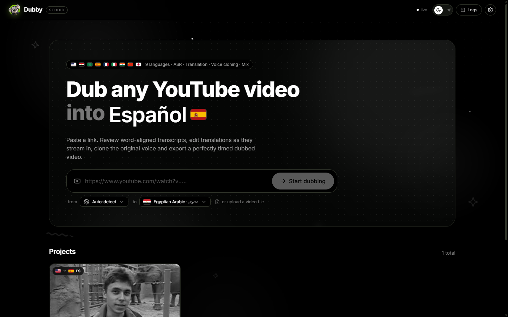
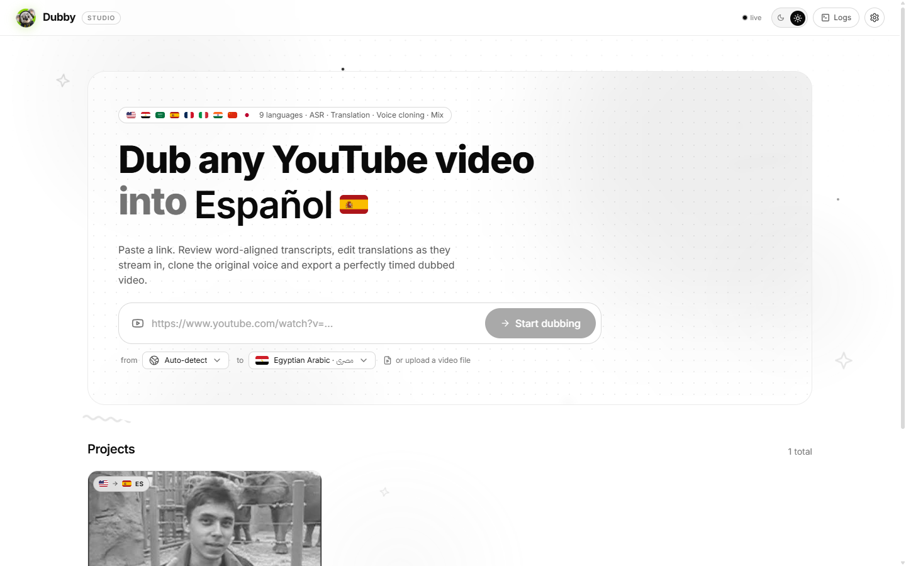
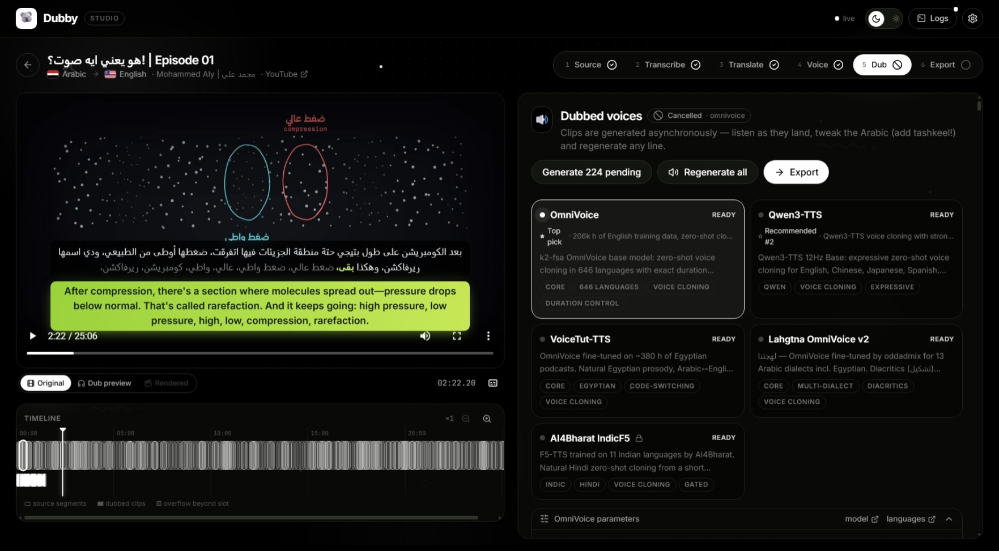
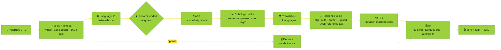

<div align="center">

---

## 🌍 Languages & recommended engines

Dubby dubs **from 8 spoken languages into 9 dub languages**. Set the spoken language to **Auto-detect**: after download, faster-whisper identifies it and every stage switches to the recommended engine for that language. The ranked recommendations appear in the UI (★ Top pick), in `dubby languages`, and in the tables below.

<table>
  <tr>
    <th align="left">Language</th>
    <th align="center">Spoken</th>
    <th align="center">Dub</th>
    <th align="left">🎙️ ASR (ranked)</th>
    <th align="left">🔊 TTS (ranked)</th>
    <th align="right">OmniVoice data</th>
  </tr>
  <tr><td> <b>English</b></td><td align="center">✅</td><td align="center">✅</td><td>WhisperX › Parakeet › Qwen3-ASR › Cohere</td><td>OmniVoice › Qwen3-TTS</td><td align="right">206 k h</td></tr>
  <tr><td> <b>Arabic</b> (spoken)</td><td align="center">✅</td><td align="center">—</td><td>Cohere Arabic › QwenCleo › CohereX › Qwen3-ASR › WhisperX › Metro</td><td align="center">—</td><td align="right">—</td></tr>
  <tr><td> <b>Egyptian Arabic</b> · مصري</td><td align="center">—</td><td align="center">✅</td><td align="center">—</td><td>VoiceTut › Lahgtna › OmniVoice</td><td align="right">23 h</td></tr>
  <tr><td> <b>Modern Standard Arabic</b> · فصحى</td><td align="center">—</td><td align="center">✅</td><td align="center">—</td><td>Lahgtna › VoiceTut › OmniVoice</td><td align="right">1.5 k h</td></tr>
  <tr><td> <b>Spanish</b> · Español</td><td align="center">✅</td><td align="center">✅</td><td>Qwen3-ASR › Parakeet › Cohere › WhisperX</td><td>OmniVoice › Qwen3-TTS</td><td align="right">27.6 k h</td></tr>
  <tr><td> <b>French</b> · Français</td><td align="center">✅</td><td align="center">✅</td><td>Qwen3-ASR › Parakeet › Cohere › WhisperX</td><td>OmniVoice › Qwen3-TTS</td><td align="right">23.7 k h</td></tr>
  <tr><td> <b>Italian</b> · Italiano</td><td align="center">✅</td><td align="center">✅</td><td>Qwen3-ASR › Parakeet › Cohere › WhisperX</td><td>OmniVoice › Qwen3-TTS</td><td align="right">9.4 k h</td></tr>
  <tr><td> <b>Hindi</b> · हिन्दी</td><td align="center">✅</td><td align="center">✅</td><td>Qwen3-ASR › WhisperX</td><td><b>IndicF5</b> › OmniVoice</td><td align="right">⚠️ 117 h</td></tr>
  <tr><td> <b>Chinese</b> · 中文</td><td align="center">✅</td><td align="center">✅</td><td>Qwen3-ASR › Cohere › WhisperX</td><td>OmniVoice › Qwen3-TTS</td><td align="right">111 k h</td></tr>
  <tr><td> <b>Japanese</b> · 日本語</td><td align="center">✅</td><td align="center">✅</td><td>Qwen3-ASR › WhisperX (Kotoba-Whisper) › Cohere</td><td>OmniVoice › Qwen3-TTS</td><td align="right">37 k h</td></tr>
</table>

### 🔁 Translation recommendations

| From → To                    | Ranked engines                                                          | Why                                                                                         |
| :---------------------------- | :---------------------------------------------------------------------- | :------------------------------------------------------------------------------------------ |
| English/Arabic → Egyptian    | **Emhotob-50M** › Masrawy › Jisr › LLM › NLLB                 | Purpose-built Egyptian translators by oddadmix                                              |
| English/Arabic → MSA         | **Emhotob-50M** › Hunyuan-MT › Jisr › NLLB › LLM              | Emhotob scores BLEU 46 on En→MSA                                                           |
| English → Hindi              | **IndicTrans2** › Hunyuan-MT › NLLB › LLM                      | AI4Bharat's state-of-the-art English→Indic model                                           |
|  Egyptian Arabic →  English  | **ArzEn-LLM** › LLM (4-bit) › NLLB (`arz_Arab`) › Hunyuan-MT | Llama-3-8B fine-tuned on code-switched Egyptian speech (BLEU 53.6); all four fit a 16 GB T4 |
| Any →                        | **Hunyuan-MT-7B** › LLM › NLLB                                  | Hunyuan-MT won 30 of 31 WMT25 language pairs                                                |
| Any →                        | **Hunyuan-MT-7B** › Qwen LLM › NLLB                             | Official Chinese prompt template; Qwen is also excellent for CJK                            |
| Same language (e.g. en → en) | **Keep original text**                                            | Re-voice a video without translating                                                        |

> [!NOTE]
> **How the TTS rankings were chosen.** OmniVoice publishes its training hours per language. English, Chinese, Japanese, Spanish, French and Italian all have 9k–206k hours, so OmniVoice is the top pick there: it clones voices and can generate each clip to the exact segment length. Hindi has only **117 h**, so **IndicF5** (AI4Bharat) is recommended for Hindi. Egyptian and MSA use the Arabic fine-tunes **VoiceTut** and **Lahgtna**; MSA is produced by the same checkpoints through the `arb` language id.

---

## ⚡ Quick start

<table>
  <tr>
    <td width="33%" valign="top">
      <h3>☁️ Google Colab</h3>
      No local install and a free GPU. Isolated venvs, and every cell fails loudly on errors.
      <br /><br />
      <a href="https://colab.research.google.com/github/MohammedAly22/Dubby/blob/main/notebooks/Dubby_Colab.ipynb"></a>
    </td>
    <td width="33%" valign="top">
      <h3>💻 Local studio</h3>
      Conda env with Python 3.11, Node.js 22 and ffmpeg.
      <br /><br />
      <code>./scripts/setup.sh --qwen --indic</code><br />
      <code>conda activate dubby</code><br />
      <code>dubby serve</code>
    </td>
    <td width="33%" valign="top">
      <h3>🤖 Headless</h3>
      Auto-detects the language and uses the recommended engine at each stage.
      <br /><br />
      <code>dubby dub "URL" --target ja</code><br />
      <code>dubby languages</code>
    </td>
  </tr>
</table>

---

## 🖼️ Screenshots

<table>
  <tr>
    <td width="50%"></td>
    <td width="50%"></td>
  </tr>
  <tr>
    <td align="center"><sub>🌙 Dark mode</sub></td>
    <td align="center"><sub>☀️ Light mode</sub></td>
  </tr>
  <tr>
    <td colspan="2"></td>
  </tr>
  <tr>
    <td colspan="2" align="center"><sub>🎬 Project workspace: player with subtitles, timeline with source and dub lanes, and one panel per stage</sub></td>
  </tr>
</table>

---

## ✨ Features

<table>
  <tr>
    <td width="33%" valign="top">
      <h4>🌐 Language auto-detection</h4>
      faster-whisper votes over several speech windows after download, then sets the spoken language and the recommended engines.
    </td>
    <td width="33%" valign="top">
      <h4>★ Per-language recommendations</h4>
      Ranked engines for every stage and language pair, each with a reason. Click <i>Use recommended</i> to apply one, and changing a language re-picks the stages that depend on it.
    </td>
    <td width="33%" valign="top">
      <h4>🎙️ Word-aligned transcripts</h4>
      Qwen3 forced aligner or wav2vec2 per language. Chinese and Japanese are aligned per character. Click a word to seek, and split, merge or edit chunks.
    </td>
  </tr>
  <tr>
    <td valign="top">
      <h4>🌍 Streaming translation</h4>
      Hunyuan-MT, NLLB-200, IndicTrans2, oddadmix Egyptian models, or a context-aware LLM. Each line appears as soon as it is ready.
    </td>
    <td valign="top">
      <h4>🧬 Voice cloning + auto reference text</h4>
      Clone from a range of the video, per segment, from an upload, or from a studio voice. Uploaded or clipped references are <b>transcribed with any ASR engine</b> to use as the TTS reference text.
    </td>
    <td valign="top">
      <h4>🔊 Async TTS with review</h4>
      OmniVoice, Qwen3-TTS, IndicF5, VoiceTut or Lahgtna. Listen as clips arrive, fix lines (with a tashkeel bar for Arabic) and regenerate just that line.
    </td>
  </tr>
  <tr>
    <td valign="top">
      <h4>⏱️ Timing</h4>
      OmniVoice generates each clip to its segment's duration. At render, clips that overflow their slot are sped up with pitch-preserving <code>atempo</code>, then trimmed.
    </td>
    <td valign="top">
      <h4>👀 Preview before rendering</h4>
      <i>Dub preview</i> plays the clips in sync over the video. <i>Rendered</i> plays the final mix with word-highlighted captions for both languages.
    </td>
    <td valign="top">
      <h4>🧠 Isolated model workers</h4>
      Four engine families (core, qwen, nemo, indic), each in its own interpreter, so incompatible transformers versions coexist. Stopping a family frees its VRAM, and cancel kills its worker process.
    </td>
  </tr>
  <tr>
    <td valign="top">
      <h4>🎨 Studio UI</h4>
      Black & white UI with light and dark themes, an animated background, dropdowns with real flags, and a live logs drawer. It works on phones and tablets, and fullscreen keeps the captions.
    </td>
    <td valign="top">
      <h4>📟 Readable terminal</h4>
      Rich stage banners, progress bars, detected language, live transcripts and translations, and clip-fit reports.
    </td>
    <td valign="top">
      <h4>💾 Saved progress</h4>
      Every project, stage, edit and clip is saved to disk, so an interrupted studio resumes where it left off.
    </td>
  </tr>
  <tr>
    <td valign="top">
      <h4>🖥️ Fits your GPU</h4>
      Dubby detects the GPU and greys out models that can't fit it, with the reason and a one-click fix. It refuses a load before it can run out of memory, and loads 7B–12B translators in 4-bit on a 16 GB T4.
    </td>
    <td valign="top">
      <h4>⬇️ Live downloads & notifications</h4>
      Model weights download with progress bars, speed and ETA in the logs. A notification appears when each stage finishes, and regenerated clips play automatically.
    </td>
    <td valign="top">
      <h4>🩺 Errors you can act on</h4>
      Out-of-memory, gated models, missing packages and network failures come back as a plain message with the next step. A crashed view recovers without losing your project.
    </td>
  </tr>
  <tr>
    <td valign="top">
      <h4>💬 Captions burned into the video</h4>
      After a render, wav2vec2 aligns every word of the <b>dubbed</b> speech. Export with <i>original</i>, <i>dub</i>, <i>both</i> or no captions. They look exactly like the player: the same fonts (Inter, IBM Plex Sans Arabic, Noto), boxes, glow, per-word highlighting and right-to-left layout.
    </td>
    <td valign="top">
      <h4>📡 Requests monitor</h4>
      <b>Logs → Requests</b> lists every unit of work (VAD, ASR, translation calls, TTS batches, alignment, model loads, ffmpeg, renders, exports) with totals, live status, duration, engine and errors.
    </td>
    <td valign="top">
      <h4>📤 Upload progress</h4>
      Uploading a local video shows a progress bar with size, speed and time left, then <i>preparing for analysis</i> until the studio has the file.
    </td>
  </tr>
</table>

---

## 🧭 Pipeline



> [!TIP]
> You can review and edit between every step, and nothing runs until you start it. Fix a word, retranslate a line or re-transcribe the reference, then regenerate only that clip.

---

## 🧩 Engines

### 🎙️ Speech recognition

| Engine                             | ID                           | Family | Spoken languages        | Word timings                                       | Highlights                                                                      |
| :--------------------------------- | :--------------------------- | :----: | :---------------------- | :------------------------------------------------- | :------------------------------------------------------------------------------ |
| **WhisperX**                 | `whisperx`                 |  core  | en ar es fr it hi zh ja | wav2vec2 per language                              | Batched faster-whisper, plus a Kotoba-Whisper option for Japanese               |
| **Qwen3-ASR**                | `qwen3-asr`                |  qwen  | en ar es fr it hi zh ja | Qwen3-ForcedAligner (en zh ja es fr it) / wav2vec2 | SOTA open ASR (1.7B / 0.6B)                                                     |
| **NVIDIA Parakeet TDT**      | `parakeet`                 |  nemo  | en es fr it             | native                                             | Fastest ASR, 25 European languages                                              |
| **Cohere Transcribe**        | `cohere-transcribe`        |  core  | en ar es fr it zh ja    | wav2vec2                                           | 🔒 gated · Open ASR leaderboard#1 at release                                   |
| **Cohere Transcribe Arabic** | `cohere-transcribe-arabic` |  core  | ar en                   | wav2vec2                                           |  dialects + code-switching · 🔒                                                |
| **CohereX**                  | `coherex`                  |  core  | ar en es fr it zh ja    | wav2vec2                                           | VAD → Cohere → alignment · 🔒                                                |
| **QwenCleo-ASR**             | `qwencleo`                 |  qwen  | ar                      | wav2vec2                                           |  SOTA Egyptian + code-switching                                                 |
| **Metro-ASR**                | `metro-asr`                |  core  | ar                      | wav2vec2                                           |  61.6M CTC, fast on CPU                                                         |
| **Google Gemini (API)**      | `gemini-asr`               | cloud | all 8 spoken            | estimated or wav2vec2                              | Long audio cut at silences and transcribed in parallel; no GPU · 🔑 Gemini key |
| **Whisper language ID**      | `whisper-langid`           |  core  | 99 languages            | —                                                 | Detects the spoken language                                                     |

### 🌍 Translation

| Engine                          | ID              | Family | Directions                       | Highlights                                                                                                                                                                                                                       |
| :------------------------------ | :-------------- | :----: | :------------------------------- | :------------------------------------------------------------------------------------------------------------------------------------------------------------------------------------------------------------------------------- |
| **ArzEn-LLM**             | `arzen-llm`   |  core  | ar (Egyptian) → en              | [Llama-3-8B DoRA](https://huggingface.co/ahmedheakl/arazn-llama3-english) for code-switched Egyptian speech ([paper](https://arxiv.org/abs/2406.18120)), 4-bit on a T4                                                             |
| **Tencent Hunyuan-MT-7B** | `hunyuan-mt`  |  core  | any → en es fr it hi zh ja arb  | [WMT25 winner](https://huggingface.co/tencent/Hunyuan-MT-7B), official prompts; auto 4-bit on 16 GB GPUs                                                                                                                          |
| **Meta NLLB-200**         | `nllb`        |  core  | any → all 9 (incl.`arz_Arab`) | [600M / 1.3B / 3.3B](https://huggingface.co/facebook/nllb-200-distilled-1.3B), fast batched, reads Egyptian (`arz_Arab`) input                                                                                                  |
| **AI4Bharat IndicTrans2** | `indictrans2` | indic | en → hi                         | [SOTA English→Indic](https://huggingface.co/ai4bharat/indictrans2-en-indic-1B) · 🔒                                                                                                                                             |
| **oddadmix Emhotob-50M**  | `emhotob`     |  core  | en/ar → arz · arb              | [Egyptian](https://huggingface.co/oddadmix/50M-Egyptian-Translation-v1) · [MSA](https://huggingface.co/oddadmix/50M-English-MSA-v1) · [MSA↔Egyptian](https://huggingface.co/oddadmix/50M-MSA-Egyptian-v1)                        |
| **oddadmix Masrawy v2**   | `masrawy`     |  core  | en → arz                        | [chrF 66.7](https://huggingface.co/oddadmix/masrawy-english-arabic-translator-v2)                                                                                                                                                 |
| **oddadmix Jisr-MT-50M**  | `jisr`        |  core  | en → arz · arb                 | [Multi-dialect Marian](https://huggingface.co/oddadmix/Jisr-MT-50M-AllDialects)                                                                                                                                                   |
| **Instruct LLM**          | `llm`         |  core  | any → any                       | [unsloth 4-bit](https://huggingface.co/unsloth) Qwen3 / Qwen2.5 / Llama 3.1 / Gemma 3 (or any chat model), batched, context-aware; **editable system prompt, temperature and top-p**; keeps code-switched terms for the TTS |

> [!TIP]
> **Translating on a 16 GB T4 (free Colab).** Engines and options that can't fit your GPU are greyed out with the reason, and *Apply fix* switches to a configuration that fits. Large translators load in 4-bit automatically (*Quantization → Auto*). The LLM prompt is a template: `{source}`, `{target}`, `{style}` and `{code_switching}` are filled in for each language pair, and *Preview* shows the result.
> | **Google Gemini (API)** | `gemini-translate` | cloud | any → any | Context-aware batches sent in parallel, editable system prompt; **default translator while a Gemini key is set** · 🔑 |
> | **Keep original text** | `passthrough` | core | same language | Re-voice without translating |

### 🔊 Text-to-speech

| Engine                         | ID                    | Family | Dub languages            | Duration control | Highlights                                                                                                                               |
| :----------------------------- | :-------------------- | :----: | :----------------------- | :--------------: | :--------------------------------------------------------------------------------------------------------------------------------------- |
| **OmniVoice**            | `omnivoice`         |  core  | all 9                    |        ✅        | [646 languages](https://huggingface.co/k2-fsa/OmniVoice), zero-shot cloning                                                               |
| **Qwen3-TTS**            | `qwen3-tts`         |  qwen  | en zh ja es fr it        | fitted at render | [Expressive cloning](https://huggingface.co/Qwen/Qwen3-TTS-12Hz-1.7B-Base), 1.7B / 0.6B                                                   |
| **AI4Bharat IndicF5**    | `indicf5`           | indic | hi                       | fitted at render | [Natural Hindi cloning](https://huggingface.co/ai4bharat/IndicF5) · 🔒                                                                   |
| **VoiceTut-TTS**         | `voicetut`          |  core  | all 9 (best: arz · arb) |        ✅        | [380 h of Egyptian podcasts](https://huggingface.co/mohammedaly22/VoiceTut-TTS), 17 studio voices, OmniVoice backbone for other languages |
| **Lahgtna OmniVoice v2** | `lahgtna-omnivoice` |  core  | all 9 (best: arz · arb) |        ✅        | [13 Arabic dialects](https://huggingface.co/oddadmix/lahgtna-omnivoice-v2), diacritics-aware, OmniVoice backbone for other languages      |

| **Google Gemini TTS (API)** | `gemini-tts` | cloud | all 9 | pace hint + fitted at render | 30 preset voices with previews, dialect-aware style prompt, clips generated in parallel, no reference voice · 🔑 |

### 🔷 Google Gemini engines

Add a Gemini API key ([get one](https://aistudio.google.com/apikey)) in **⚙️ Settings → Gemini API key** or in the Colab notebook. Dubby verifies it with one tiny request before saving it, and shows only a masked preview afterwards. Then:

- **Transcription:** audio is cut at silences into multi-minute chunks that are transcribed at the same time, each returning timed sentences.
- **Translation:** batches of lines, each with the neighbouring lines as context, run in parallel. The system prompt is editable. While a key is set, Gemini is the default translator for new projects.
- **Speech:** pick one of 30 preset voices in the Voice step (samples play in your dub language). All clips are generated concurrently.

Gemini engines run in the CPU-only `cloud` family: starting them never unloads your local GPU models.

**Rate limits and quotas.** Google limits every Gemini model separately, in requests per minute and per day, according to your project's usage tier. Credits pay for requests but don't raise these limits, and the preview TTS models have the lowest ones. Dubby handles a `429 RESOURCE_EXHAUSTED` for you:

- **Per-minute limit:** every request to that model pauses for the delay Google asks for, parallel requests are halved, then grow back after successes.
- **Daily limit:** waiting won't help, so Dubby continues with the next Gemini model of the same kind (for example 3.1 Flash TTS → 2.5 Flash TTS → 2.5 Pro TTS) and says so in the logs. Turn off *Switch model when a daily quota runs out* to stay on one model.

Check your limits at [ai.dev/rate-limit](https://ai.dev/rate-limit), and raise the usage tier in Google AI Studio for higher ones.

### 🔢 Text normalization

With **Normalize numbers & symbols** on (the default), the studio rewrites each line for the dub language **before** it reaches any TTS engine. It handles numbers, decimals, ordinals, money, percentages, units, dates, clock times, phone numbers, emails, URLs, @handles, #hashtags, abbreviations, symbols and acronyms. Engines never normalize again, so what you see is exactly what the voice reads: flip a clip to **Processed** to compare it with the **Raw** text, with rewritten words highlighted.

| Dub language | Examples                                                                                                                                                                                                   |
| :----------- | :--------------------------------------------------------------------------------------------------------------------------------------------------------------------------------------------------------- |
|  Egyptian    | VoiceTut-TTS's rules**without diacritics**: `3:30` → تلاتة و نص · `01147450629` → زيرو حداشر، سبعه وأربعين… · your own tashkeel is kept                        |
|  MSA         | Grammatical agreement:`3 ساعات` → ثلاث ساعات · `11 دقيقة` → إحدى عشرة دقيقة · `$1,250.50` → ألف ومئتان وخمسون دولارا وخمسون سنتا |
|  English     | `May 5, 2024` → May fifth, twenty twenty-four · `1.5M` → one point five million · `No. 7` → number seven                                                                                        |
|              | Gender and elision: veintiún años · soixante et onze · un million d'euros · un'ora · alle sedici meno un quarto                                                                                      |
|  Hindi       | Indian numbering and clock:`1,00,000` → एक लाख · `10:30` → साढ़े दस बजे                                                                                                              |
|              | `2公里` → 两公里 · `15%` → 百分之十五 · `2024年` → 二零二四年 · `時速60km/h` → 時速六十キロ                                                                                                 |

> [!IMPORTANT]
> **Reference voice language matters.** Voice cloning copies the accent of the reference clip. For natural Spanish, Chinese and other dubs, use *From this video*, *Auto per segment* or an uploaded recording in the dub language. The built-in studio voices are Egyptian Arabic.

---

## 🚀 Installation

**Prerequisites:** 🐍 [Miniconda](https://docs.conda.io/en/latest/miniconda.html) · 🎮 an NVIDIA GPU (a T4 16 GB runs every family, one at a time, with 7B+ translators in 4-bit; L4/A100 run them in 16-bit) · 🔑 a [Hugging Face token](https://huggingface.co/settings/tokens) for gated models

### One-command setup

```bash
git clone https://github.com/MohammedAly22/Dubby && cd Dubby

# Linux / macOS
./scripts/setup.sh --qwen --indic        # add --nemo for Parakeet, --cpu for CPU-only wheels

# Windows (PowerShell)
.\scripts\setup.ps1 -Qwen -Indic         # -Nemo, -Cpu
```

<details>
<summary><b>🛠️ Manual setup (step by step)</b></summary>

```bash
# 1) main env: Python 3.11 + Node.js 22 + ffmpeg + core engines
conda env create -f environment.yml
conda activate dubby

# 2) (optional) qwen family: Qwen3-ASR, QwenCleo-ASR, Qwen3-TTS  (transformers 4.57)
conda env create -f environment-qwen.yml
conda run -n dubby-qwen pip install qwencleo-asr --no-deps
conda run -n dubby-qwen pip install qwen-tts --no-deps
conda run -n dubby-qwen pip install onnxruntime einops sox

# 3) (optional) nemo family: NVIDIA Parakeet
conda env create -f environment-nemo.yml

# 4) (optional) indic family: IndicTrans2 + IndicF5 for Hindi  (transformers < 4.50)
conda env create -f environment-indic.yml
conda run -n dubby-indic pip install "git+https://github.com/ai4bharat/IndicF5.git" "transformers<4.50"

# 5) (optional) Demucs vocal separation, in the main env
pip install demucs

# 6) build the UI with Node and check everything
dubby build-ui
dubby doctor
dubby languages
```

Dubby **auto-detects** the sibling envs `dubby-qwen`, `dubby-nemo` and `dubby-indic`. You can also point a family at any interpreter from ⚙️ Settings, or with `DUBBY_PYTHON_<FAMILY>=/path/to/python`.

</details>

---

## 🎛️ Using the studio

```bash
conda activate dubby
dubby serve              # http://127.0.0.1:8765 opens automatically
```

|              Step              | What you do                                                                                                                                                                                                                                                                                                                                              |
| :----------------------------: | :------------------------------------------------------------------------------------------------------------------------------------------------------------------------------------------------------------------------------------------------------------------------------------------------------------------------------------------------------- |
|   **1 · ⬇️ Source**   | Paste a YouTube link (or upload a file, with a live upload progress bar). Leave the spoken language on**🌐 Auto-detect** and pick a dub language. After download, the detected language and its confidence appear, and the recommended engines are applied                                                                                         |
| **2 · 🎙️ Transcribe** | The recommended engine is preselected (★ Top pick). Chunks stream in with word timings: click a word to seek, ✂️ split, and merge or delete                                                                                                                                                                                                           |
|  **3 · 🌍 Translate**  | Rows fill in one by one while you edit. A*source edited* badge flags stale lines, and ↻ retranslates one line                                                                                                                                                                                                                                         |
|    **4 · 🧬 Voice**    | *From this video* · *Auto per segment* · *Studio voice* · *Upload*. Clipped and uploaded references are **transcribed with the ASR engine you choose** to become the TTS reference text                                                                                                                                                 |
|     **5 · 🔊 Dub**     | *Generate all* runs asynchronously. Listen as clips land, check the fit bar, fix lines (tashkeel bar for Arabic), ↻ regenerate, and use **Dub preview** on the video                                                                                                                                                                            |
|    **6 · 🎬 Export**    | Set the mix (ducked original / music stem / silent, levels, max speed-up, subtitle tracks),**Render**, then pick **Captions in the video** (*None · Original · Dub · Both*) and download or **Export** to disk. The dub captions are word-aligned on the rendered voice track right after each render; *Re-align* runs it again |

Every action also streams to the **terminal** and the **📟 Logs** drawer. Its **Requests** tab counts every request by status and kind (VAD, ASR, translation, TTS, alignment, model loads, renders, exports), shows what is running right now with a live timer, and expands a row for its error and details.

---

## 🤖 Command line

```bash
dubby serve [--host 0.0.0.0] [--port 8765] [--no-open] [-v]   # web studio
dubby dev [--port 8765]                                        # backend + Vite dev UI (hot reload) on :5173
dubby dub URL [options]                                        # full pipeline, no UI
dubby languages                                                # languages + ranked engine recommendations
dubby doctor                                                   # tools, interpreters, engine availability
dubby engines                                                  # engine catalogue
dubby projects                                                 # saved projects
dubby build-ui                                                 # npm ci && vite build
```

<details>
<summary><b>🎯 Headless examples</b></summary>

```bash
# auto-detect the spoken language, recommended engines everywhere
dubby dub "https://www.youtube.com/watch?v=VIDEO" --target ja --voice auto

# English → Hindi with explicit engines
dubby dub "URL" --source en --target hi --asr qwen3-asr --translation indictrans2 --tts indicf5 --voice auto

# English → Egyptian Arabic with a studio voice
dubby dub "URL" --source en --target arz --tts voicetut --voice preset:Mohamed --export ~/Videos/Dubbed

# export with both caption lines burned into the video
dubby dub "URL" --target es --captions both --export ~/Videos/Dubbed
```

`--source` accepts `auto` or `en ar es fr it hi zh ja`. `--target` accepts `arz arb en es fr it hi zh ja`. `--voice` accepts `preset:NAME`, `auto`, `clip:START-END` or `file:PATH` (with `--ref-text`). `--captions` accepts `none original dub both`. Engines you don't pass use the recommended ones.

</details>

---

## ☁️ Google Colab

<a href="https://colab.research.google.com/github/MohammedAly22/Dubby/blob/main/notebooks/Dubby_Colab.ipynb"></a>

Run [`notebooks/Dubby_Colab.ipynb`](notebooks/Dubby_Colab.ipynb) cell by cell:

`0 helpers` → `1 GPU` → `2 clone` → `3 Node.js 22` → `4 core venv` → `5 qwen / nemo / indic venvs` → `6 HF token` → `7 build UI + doctor + languages` → `🚀 launch`

* Dubby installs with **`uv` into isolated Python 3.12 venvs** under `/content/envs`, so Colab's own Python 3.13 packages never conflict with it.
* Every install step **stops with the real error**. You never see a ✅ on a failed install, and the venv's `dubby` is added to `PATH` for later cells.
* The launch cell gives you a **Colab proxy** or **Cloudflare tunnel** link. Another cell tails the studio terminal, and you can export straight to Google Drive.

---

## ⚙️ Configuration

Settings live in `~/Dubby/settings.json` and can be edited in the UI. Environment variables override them:

| Variable                                                      | Meaning                                               |
| :------------------------------------------------------------ | :---------------------------------------------------- |
| `DUBBY_HOME`                                                | Projects, cache and exports root (default`~/Dubby`) |
| `DUBBY_HOST` · `DUBBY_PORT`                              | Server bind address                                   |
| `DUBBY_DEVICE`                                              | `auto` · `cuda` · `cpu`                       |
| `DUBBY_PYTHON_CORE` · `_QWEN` · `_NEMO` · `_INDIC` | Interpreter per engine family                         |
| `HF_TOKEN`                                                  | Hugging Face token passed to workers                  |

### ▶️ YouTube downloads on Colab & cloud machines (no sign-in)

Cloud IPs (Colab, VMs) are often answered with *"Sign in to confirm you're not a bot"*. Dubby handles this for you, with no cookies and no account:

1. 🔐 **Automatic PO tokens.** Dubby builds and runs the [bgutil PO-token provider](https://github.com/Brainicism/bgutil-ytdlp-pot-provider), recommended in yt-dlp's [PO Token Guide](https://github.com/yt-dlp/yt-dlp/wiki/PO-Token-Guide). It is built once (`dubby youtube-helper`, ~1 min — the Colab install cell does it) and then starts with the studio.
2. 📺 **Client fallback.** If YouTube still blocks a request, Dubby retries through the TV, embedded and Safari player clients over IPv4, which YouTube scores differently.
3. 📁 **One-drop fallback.** If every strategy is blocked, drop the video file on the Source step — the project keeps its languages and engines.

> [!TIP]
> Still blocked? A fresh Colab runtime usually gets a new IP. A proxy (⚙️ Settings) and a cookies file are supported but optional — cookies are only really needed for members-only or age-restricted videos.

---

## 🏗️ Architecture

```
dubby/
├── cli.py                 # rich CLI: serve · dev · dub · languages · doctor · engines · projects · build-ui
├── config.py              # settings + per-family interpreter discovery (core · qwen · nemo · indic)
├── languages.py           # language registry: ISO / OmniVoice / NLLB / Qwen ids, scripts, OmniVoice hours
├── recommend.py           # ranked engine recommendations per stage and language pair
├── schemas.py             # Project / Segment / Word / TTSState … (pydantic, shared with the UI)
├── core/
│   ├── studio.py          # orchestration: detection, stages, edits, voices, render, export
│   ├── jobs.py            # GPU job queue + worker process manager (+ doctor runner)
│   ├── storage.py         # atomic project.json store with debounced autosave
│   ├── events.py          # thread-safe bus → terminal reporter + websockets
│   ├── reporter.py        # rich terminal output
│   └── voices.py          # preset voices, reference clip cutting
├── workers/               # JSON-lines protocol · worker loop (asr · asr_ref · langid · translation · tts) · doctor
├── engines/
│   ├── asr/               # whisperx · qwen (Qwen3 + QwenCleo) · cohere · coherex · parakeet · metro · common
│   ├── translation/       # hunyuan · nllb · indictrans2 · emhotob · masrawy · jisr · llm · passthrough
│   ├── tts/               # omnivoice_base · omnivoice · qwen3_tts · indicf5 · voicetut · lahgtna
│   ├── langid/            # whisper_langid
│   └── separation/        # demucs
├── pipeline/              # chunking (script-aware) · render (mix + fit + mux) · subtitles
├── media/                 # youtube (yt-dlp) · ffmpeg wrappers
├── server/app.py          # FastAPI REST + websocket + range-enabled media + SPA
└── web/dist/              # built UI (from ui/)
ui/                        # React + TypeScript + Tailwind v4 source
assets/                    # banner, flags, screenshots
notebooks/Dubby_Colab.ipynb
```

**Why worker processes?** The studio process never imports a model. Each engine family gets one long-lived worker that keeps its model loaded, so regenerating one clip is fast. The families pin different `transformers` versions (5.x core, 4.57 qwen, < 4.50 indic), and separate interpreters let them coexist. With *exclusive GPU* on, starting a job in one family first stops the others so their VRAM is released.

<details>
<summary><b>➕ Adding an engine or a language</b></summary>

1. **Engine:** subclass `ASREngine`, `TranslationEngine` or `TTSEngine`, declare `EngineInfo` (languages, family, requires, params), and register it in `engines/registry.py`.
2. **Language:** add a `Language(...)` entry in `dubby/languages.py` with its ISO / OmniVoice / NLLB / Qwen ids, then add ranked entries in `dubby/recommend.py`, a flag in `assets/`, and a `LANGS` entry in `ui/src/components/Flags.tsx`.

```python
# dubby/engines/tts/my_tts.py
from dubby.engines.base import EngineInfo, ParamSpec, TTSEngine

class MyTTS(TTSEngine):
    info = EngineInfo(id="my-tts", kind="tts", name="My TTS", family="core",
                      targets=["es", "fr"], requires=["my_tts"], install="pip install my-tts",
                      params=[ParamSpec("speed", "Speed", "number", 1.0, min=0.5, max=2, step=0.05)])
    load_params = ("model",)

    def load(self, ctx):              # heavy imports go inside methods
        import my_tts
        self.model = my_tts.load(device=self.device)

    def synthesize(self, items, target, ctx):
        import soundfile as sf
        for it in items:
            wav, sr = self.model.speak(it.text, ref=it.ref_audio, ref_text=it.ref_text, seconds=it.duration)
            sf.write(it.out_path, wav, sr)
            yield it, len(wav) / sr
```

</details>

---

## 🩺 Troubleshooting

| Symptom                                                                 | Fix                                                                                                                                                                                                         |
| :---------------------------------------------------------------------- | :---------------------------------------------------------------------------------------------------------------------------------------------------------------------------------------------------------- |
| Engine shows**not installed**                                     | `dubby doctor` prints the exact `pip install …` for the right family interpreter                                                                                                                       |
| **CUDA out of memory**                                            | Set*Quantization* to *Auto* or 4-bit, lower the batch size, or pick a smaller checkpoint. Dubby frees the failed model's memory, so the next run starts clean                                           |
| Engine card greyed out:*needs 18 GB*                                  | It can't fit the detected GPU in any configuration. Pick another engine, or run on a bigger GPU (L4 / A100)                                                                                                 |
| **Worker exited unexpectedly**                                    | Usually out of system RAM (code -9) or GPU memory. Use 4-bit or a smaller checkpoint (NLLB 600M, Qwen3-ASR 0.6B), and keep*exclusive GPU* on                                                              |
| Model download seems stuck                                              | Open**Logs**: each file shows a progress bar with speed and ETA. Hugging Face xet downloads also show a short *reconstructing* phase                                                                |
| 401/403 on Cohere, IndicF5 or IndicTrans2 | Accept the model terms on Hugging Face and add your token in Settings |
| Gemini `429 RESOURCE_EXHAUSTED` although you have credits | Per-model limits come from your usage tier, not your balance. Dubby waits out per-minute limits and switches model when a daily quota runs out; see [ai.dev/rate-limit](https://ai.dev/rate-limit) |
| Wrong spoken language detected                                          | Pick it manually in the Source step. The engines re-pick automatically                                                                                                                                      |
| Dub has a foreign accent                                                | Use a reference voice in the dub language (clip, upload or auto) instead of an Egyptian studio voice                                                                                                        |
| Weak Hindi pronunciation                                                | Use IndicF5 (indic family) instead of OmniVoice, which has only 117 h of Hindi                                                                                                                              |
| Colab:`dubby: command not found`                                      | Re-run step 4. It installs into`/content/envs/dubby` and adds it to `PATH`, and it stops with the real error if the install fails                                                                       |
| *Sign in to confirm you're not a bot* / *blocked by YouTube*        | Handled automatically ([see above](#️-youtube-downloads-on-colab--cloud-machines-no-sign-in)) — if every strategy fails, drop the video file on the Source step, or restart the Colab runtime for a new IP |
| `youtube token helper: not built` in `dubby doctor`                 | Run`dubby youtube-helper --check` (needs `node` ≥ 20, `npm` and `git`), and keep tooling current: `pip install -U "yt-dlp[default]" bgutil-ytdlp-pot-provider`                                   |
| `Could not resolve host: github.com`                                  | Your network is blocking GitHub's DNS. Use another network or ask your admin                                                                                                                                |
| Dev UI shows*backend not reachable*                                   | Start`dubby serve`, or run `dubby dev` to launch the backend and Vite together                                                                                                                          |
| Burned captions use a different font | The first captioned export downloads the studio fonts from Google Fonts into `<DUBBY_HOME>/cache/fonts`. Offline, system fonts are used; connect once and export again |
| Dub captions say*estimated*                                           | Word alignment needs the wav2vec2 model for the dub language (downloaded on first use). Press*Re-align* in the Export step, and check the **Requests** tab for the error                            |
| Clips sound rushed                                                      | Lower*Max speed-up*, shorten the line, or raise *Max chunk*                                                                                                                                             |
| Mispronounced names                                                     | Rephrase the line (for Arabic, add tashkeel with the diacritics bar) and regenerate it                                                                                                                      |

---

## 🤝 Contributing

New models, languages and dialects are very welcome. **[CONTRIBUTING.md](CONTRIBUTING.md)** walks through each one with copy-paste code:

- **Add a model:** one engine class plus a registry line. It appears in the studio with its parameters, VRAM checks and install hints.
- **Add an engine family:** its own venv for models with conflicting dependencies (`environment-<family>.yml`, a pyproject extra, a setup flag and a Colab checkbox).
- **Add a language or dialect:** `languages.py`, `recommend.py` and one entry in the UI flags.

---

## 🙏 Credits

Dubby builds on these open-source projects:

[WhisperX](https://github.com/m-bain/whisperX) ·
[faster-whisper](https://github.com/SYSTRAN/faster-whisper) ·
[Qwen3-ASR](https://github.com/QwenLM/Qwen3-ASR) ·
[Qwen3-TTS](https://github.com/QwenLM/Qwen3-TTS) ·
[Cohere Transcribe](https://huggingface.co/CohereLabs/cohere-transcribe-arabic-07-2026) ·
[CohereX](https://github.com/bakrianoo/cohereX) ·
[NVIDIA NeMo](https://github.com/NVIDIA/NeMo) ·
[QwenCleo-ASR](https://github.com/MohammedAly22/qwencleo-asr) ·
[Metro-ASR](https://github.com/MohammedAly22/metro-asr) ·
[Hunyuan-MT](https://huggingface.co/tencent/Hunyuan-MT-7B) ·
[ArzEn-LLM](https://huggingface.co/ahmedheakl/arazn-llama3-english) ·
[unsloth](https://github.com/unslothai/unsloth) ·
[bitsandbytes](https://github.com/bitsandbytes-foundation/bitsandbytes) ·
[NLLB-200](https://huggingface.co/facebook/nllb-200-distilled-1.3B) ·
[IndicTrans2](https://github.com/AI4Bharat/IndicTrans2) ·
[IndicF5](https://github.com/AI4Bharat/IndicF5) ·
[oddadmix models](https://huggingface.co/oddadmix) ·
[OmniVoice](https://github.com/k2-fsa/OmniVoice) ·
[VoiceTut-TTS](https://github.com/MohammedAly22/VoiceTuT-TTS) ·
[Demucs](https://github.com/adefossez/demucs) ·
[yt-dlp](https://github.com/yt-dlp/yt-dlp) ·
[Silero VAD](https://github.com/snakers4/silero-vad) ·
flags from [flagcdn](https://flagcdn.com)

Each model keeps its own license. Check them before commercial use.

> [!WARNING]
> **Responsible use:** only dub content you have the rights to, get consent before cloning a real person's voice, and never use Dubby to impersonate or mislead.

<div align="center">
