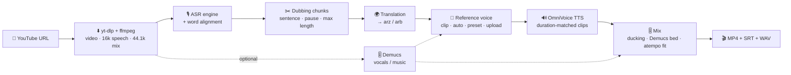

<div align="center">

---

## ✨ Features

|                                        |                                                                                                                                                                                                 |
| -------------------------------------- | ----------------------------------------------------------------------------------------------------------------------------------------------------------------------------------------------- |
| 🎬**YouTube in, dubbed MP4 out** | yt-dlp (with Node.js for YouTube's JS challenges) → timed Arabic dub, embedded subtitles, WAV stems                                                                                            |
| 🧩**Pluggable engines**          | 8 ASR, 4 translation and 2 TTS engines, plus Demucs separation. Adding a new engine takes one class                                                                                             |
| 🎙️**Word-aligned transcripts** | Each chunk shows its words with timestamps, highlighted while the video plays. Click a word to seek, and edit, split, merge or delete chunks                                                    |
| 🌍**Streaming translation**      | Each translated chunk shows up as soon as it is ready. Edit lines or retranslate a single one                                                                                                   |
| 🧬**Voice cloning**              | Clone the voice from a range of the video, clone each speaker automatically per chunk, upload a recording, or pick one of 17 studio voices                                                      |
| 🔊**Async TTS with review**      | Listen to clips as they arrive, add tashkeel from the on-screen diacritics bar, regenerate stale lines, and see each clip's fit against its slot                                                |
| ⏱️**Timing**                   | OmniVoice generates each clip to the segment duration. At render, overflowing clips are sped up with pitch-preserving`atempo`, then trimmed                                                   |
| 👀**Preview before rendering**   | *Dub preview* plays the generated clips in sync over the original video. *Rendered* plays the final mix                                                                                     |
| 📟**Readable terminal output**   | Rich stage banners, progress bars, live transcripts, translations and clip-fit reports                                                                                                          |
| 🧠**Isolated model workers**     | Each engine family runs in a long-lived subprocess, optionally with its own interpreter. Incompatible stacks don't clash, GPU memory is freed when a family stops, and cancel kills the process |
| 💾**Progress tracking**          | Every project, stage state, edit and clip is saved to disk, so an interrupted studio resumes where it left off                                                                                  |
| ☁️**Google Colab**             | A cell-by-cell notebook installs everything and opens the studio in your browser                                                                                                                |

---

## 🧭 Pipeline



You can review and edit in the UI between every step. Nothing runs unless you start it.

---

## 🧩 Engines

### 🎙️ Speech recognition

| Engine                                                             | Family | Languages | Timestamps                               | Notes                                       |
| ------------------------------------------------------------------ | ------ | --------- | ---------------------------------------- | ------------------------------------------- |
| **WhisperX** · `whisperx`                                 | core   | en, ar    | wav2vec2 forced alignment                | Default for English. Batched faster-whisper |
| **NVIDIA Parakeet TDT** · `parakeet`                      | nemo   | en        | native word stamps                       | Fastest English ASR (0.6B)                  |
| **Qwen3-ASR** · `qwen3-asr`                               | qwen   | en, ar    | Qwen3-ForcedAligner (en) / wav2vec2 (ar) | SOTA open ASR (1.7B / 0.6B)                 |
| **Cohere Transcribe** · `cohere-transcribe`               | core   | en, ar    | wav2vec2                                 | 🔒 gated                                    |
| **Cohere Transcribe Arabic** · `cohere-transcribe-arabic` | core   | ar, en    | wav2vec2                                 | 🇪🇬 dialects + code-switching · 🔒 gated  |
| **CohereX** · `coherex`                                   | core   | ar, en    | wav2vec2 (CohereX pipeline)              | 🇪🇬 VAD → Cohere → alignment · 🔒 gated |
| **QwenCleo-ASR** · `qwencleo`                             | qwen   | ar        | wav2vec2                                 | 🇪🇬 SOTA Egyptian + code-switching         |
| **Metro-ASR** · `metro-asr`                               | core   | ar        | wav2vec2                                 | 🇪🇬 61.6M CTC, fast on CPU, optional KenLM |

### 🌍 Translation

| Engine                                        | Directions                         | Notes                                                                                                                                                                                                                                                   |
| --------------------------------------------- | ---------------------------------- | ------------------------------------------------------------------------------------------------------------------------------------------------------------------------------------------------------------------------------------------------------- |
| **oddadmix Emhotob-50M** · `emhotob` | en→arz, en→arb, ar→arb, ar→arz | [50M-Egyptian-Translation-v1](https://huggingface.co/oddadmix/50M-Egyptian-Translation-v1), [50M-English-MSA-v1](https://huggingface.co/oddadmix/50M-English-MSA-v1) (BLEU 46), [50M-MSA-Egyptian-v1](https://huggingface.co/oddadmix/50M-MSA-Egyptian-v1) |
| **oddadmix Jisr-MT-50M** · `jisr`    | en→arz, en→arb                   | [Jisr-MT-50M-AllDialects](https://huggingface.co/oddadmix/Jisr-MT-50M-AllDialects): Marian with dialect tags, batched beam search                                                                                                                        |
| **oddadmix Masrawy v2** · `masrawy`  | en→arz                            | [masrawy-english-arabic-translator-v2](https://huggingface.co/oddadmix/masrawy-english-arabic-translator-v2) (chrF 66.7)                                                                                                                                 |
| **Instruct LLM** · `llm`             | en/ar → arz/arb                   | Any chat model (default Qwen3-4B-Instruct-2507). Uses previous lines as context and aims for a similar spoken length                                                                                                                                    |

### 🔊 Text-to-speech (OmniVoice family)

| Engine                                                  | Egyptian  | MSA       | Notes                                                                                                                                                       |
| ------------------------------------------------------- | --------- | --------- | ----------------------------------------------------------------------------------------------------------------------------------------------------------- |
| **VoiceTut-TTS** · `voicetut`                  | ✅`arz` | ✅`arb` | [mohammedaly22/VoiceTut-TTS](https://huggingface.co/mohammedaly22/VoiceTut-TTS): 380 h of Egyptian podcasts, code-switching, 17 voices, number normalization |
| **Lahgtna OmniVoice v2** · `lahgtna-omnivoice` | ✅`arz` | ✅`arb` | [oddadmix/lahgtna-omnivoice-v2](https://huggingface.co/oddadmix/lahgtna-omnivoice-v2): 13 Arabic dialects, benefits from diacritics                          |

> MSA comes from the **same checkpoints**: Dubby switches the OmniVoice language id from `arz` to `arb`. No extra model is needed.

---

## 🚀 Installation

### Prerequisites

* 🐍 [Miniconda](https://docs.conda.io/en/latest/miniconda.html)
* 🎮 An NVIDIA GPU is strongly recommended (a T4 16 GB runs everything one family at a time). CPU works for short clips.
* 🔑 A [Hugging Face token](https://huggingface.co/settings/tokens) if you want the gated Cohere engines

### One-command setup

```bash
git clone https://github.com/MohammedAly22/dubby && cd dubby

# Linux / macOS
./scripts/setup.sh --qwen          # add --nemo for Parakeet, --cpu for CPU-only wheels

# Windows (PowerShell)
.\scripts\setup.ps1 -Qwen          # -Nemo, -Cpu
```

### Manual setup

```bash
# 1) main env: Python 3.11 + Node.js 22 + ffmpeg + core engines
conda env create -f environment.yml
conda activate dubby

# 2) (optional) Qwen3-ASR / QwenCleo-ASR — separate env because qwen-asr pins transformers 4.57
conda env create -f environment-qwen.yml
conda run -n dubby-qwen pip install qwencleo-asr --no-deps

# 3) (optional) NVIDIA Parakeet
conda env create -f environment-nemo.yml

# 4) (optional) Demucs vocal separation, in the main env
pip install demucs

# 5) build the UI with Node and check everything
dubby build-ui
dubby doctor
```

Dubby **auto-detects** the sibling envs `dubby-qwen` and `dubby-nemo`. You can also point a family at any interpreter from the ⚙️ Settings dialog, or with `DUBBY_PYTHON_QWEN=/path/to/python`.

---

## 🎛️ Using the studio

```bash
conda activate dubby
dubby serve              # http://127.0.0.1:8765 opens automatically
```

1. **⬇️ Source.** Paste a YouTube link (or upload a file) and pick *English/Arabic → مصري/فصحى*.
2. **🎙️ Transcribe.** Choose an engine and tune its parameters. Chunks stream in live. Each chunk shows its words with timings: click a word to seek, use ✂️ to split before a word, and merge or delete chunks. The *Dubbing chunk rules* set the max length, min length and pause threshold.
3. **🌍 Translate.** Pick a translator. Rows fill in one by one while you edit. A *source edited* badge marks lines whose transcript changed, and ↻ retranslates a single line.
4. **🧬 Voice.** Choose one:
   * **From this video**: mark *start/end = now* on the timeline (3–12 s of clean speech). The transcript is filled from the aligned words.
   * **Auto per segment**: every chunk clones its own speaker, which handles multi-speaker videos.
   * **Studio voice**: preview and pick one of 17 voices.
   * **Upload**: your own recording plus its transcript.
   * Optionally run **Demucs** for cleaner references and a music-only background.
5. **🔊 Dub.** *Generate all* voices the clips asynchronously. Listen as they land, check the fit bar (dub length vs slot), add tashkeel with the diacritics bar, and ↻ regenerate stale lines. **Dub preview** in the player plays the clips over the video with the original ducked.
6. **🎬 Export.** Set the mix (ducked original / music stem / silent, levels, max speed-up, overflow policy, subtitles), then **Render**. Watch the result in the player, download the MP4/WAV/SRT, or **Export** to a folder on disk.

Every action streams to the **terminal** and to the **📟 Logs** drawer.

---

## 🤖 Command line

```bash
dubby serve [--host 0.0.0.0] [--port 8765] [--no-open] [-v]   # web studio
dubby dev [--port 8765]                                        # backend + Vite dev UI (hot reload) on :5173
dubby dub URL [options]                                        # full pipeline, no UI
dubby doctor                                                   # tools, interpreters, engine availability
dubby engines                                                  # engine catalogue
dubby projects                                                 # saved projects
dubby build-ui                                                 # npm ci && vite build
```

Headless example:

```bash
dubby dub "https://www.youtube.com/watch?v=VIDEO" \
  --source en --target arz \
  --asr whisperx --asr-param model=large-v3-turbo \
  --translation emhotob \
  --tts voicetut --tts-param num_step=32 \
  --voice auto \
  --export ~/Videos/Dubbed
```

`--voice` accepts `preset:NAME`, `auto`, `clip:START-END` (seconds) or `file:PATH` (with `--ref-text`).

---

## ☁️ Google Colab

Open [`notebooks/Dubby_Colab.ipynb`](notebooks/Dubby_Colab.ipynb) in Colab and run the cells in order:

1. GPU check → 2. clone → 3. Node.js 22 → 4. core engines → 5. optional Qwen/NeMo venvs → 6. HF token → 7. build UI → 🚀 launch

The launch cell gives you either a **Colab proxy** link or a public **Cloudflare tunnel** link. Another cell tails the studio terminal, and you can export straight to Google Drive. The UI falls back to HTTP polling if a proxy blocks websockets.

---

## ⚙️ Configuration

Settings live in `~/Dubby/settings.json` (editable in the UI). Environment variables override them:

| Variable                                      | Meaning                                               |
| --------------------------------------------- | ----------------------------------------------------- |
| `DUBBY_HOME`                                | Projects, cache and exports root (default`~/Dubby`) |
| `DUBBY_HOST` / `DUBBY_PORT`               | Server bind address                                   |
| `DUBBY_DEVICE`                              | `auto` · `cuda` · `cpu`                       |
| `DUBBY_PYTHON_CORE` / `_QWEN` / `_NEMO` | Interpreter per engine family                         |
| `HF_TOKEN`                                  | Hugging Face token passed to workers                  |

YouTube asking you to *"sign in to confirm you're not a bot"*? Export a `cookies.txt` from your browser and set **YouTube cookies file** in Settings.

---

## 🏗️ Architecture

```
dubby/
├── cli.py                 # rich CLI: serve · dub · doctor · engines · projects · build-ui
├── config.py              # settings + per-family interpreter discovery
├── schemas.py             # Project / Segment / Word / TTSState … (pydantic, shared with the UI)
├── core/
│   ├── studio.py          # orchestration: stages, edits, voices, render, export
│   ├── jobs.py            # GPU job queue + worker process manager (+ doctor runner)
│   ├── storage.py         # atomic project.json store with debounced autosave
│   ├── events.py          # thread-safe bus → terminal reporter + websockets
│   ├── reporter.py        # rich terminal output
│   └── voices.py          # preset voices, reference clip cutting
├── workers/
│   ├── protocol.py        # JSON-lines protocol (stdout is kept clean for protocol lines)
│   ├── main.py            # worker loop: load/unload engines, run tasks, stream results
│   └── doctor.py          # import checks for one interpreter
├── engines/
│   ├── base.py            # Engine / ASREngine / TranslationEngine / TTSEngine contracts
│   ├── registry.py        # id → class
│   ├── asr/               # whisperx · qwen (Qwen3 + QwenCleo) · cohere · coherex · parakeet · metro · common (VAD + alignment)
│   ├── translation/       # emhotob · jisr · masrawy · llm
│   ├── tts/               # omnivoice_base · voicetut · lahgtna
│   └── separation/        # demucs
├── pipeline/              # chunking · render (mix + fit + mux) · subtitles
├── media/                 # youtube (yt-dlp) · ffmpeg wrappers
├── server/app.py          # FastAPI REST + websocket + range-enabled media + SPA
└── web/dist/              # built UI (from ui/)
ui/                        # React + TypeScript + Tailwind v4 source
notebooks/Dubby_Colab.ipynb
```

**Why worker processes?** The studio process never imports a model. Each engine family gets one long-lived worker. A worker keeps its model loaded, so regenerating a single clip is fast. Tasks are queued so jobs share the GPU. With *exclusive GPU* on, starting a Qwen job first stops the core worker so its VRAM is released.

### ➕ Adding an engine

```python
# dubby/engines/tts/my_tts.py
from dubby.engines.base import EngineInfo, ParamSpec, TTSEngine

class MyTTS(TTSEngine):
    info = EngineInfo(id="my-tts", kind="tts", name="My TTS", family="core",
                      targets=["arz", "arb"], requires=["my_tts"], install="pip install my-tts",
                      params=[ParamSpec("speed", "Speed", "number", 1.0, min=0.5, max=2, step=0.05)])
    load_params = ("model",)

    def load(self, ctx):              # heavy imports go inside methods
        import my_tts
        self.model = my_tts.load(device=self.device)

    def synthesize(self, items, target, ctx):
        for it in items:
            wav, sr = self.model.speak(it.text, ref=it.ref_audio, seconds=it.duration)
            import soundfile as sf; sf.write(it.out_path, wav, sr)
            yield it, len(wav) / sr
```

Register it in `engines/registry.py`. It then appears in the UI, `dubby doctor` and the CLI.

---

## 🩺 Troubleshooting

| Symptom                              | Fix                                                                                                             |
| ------------------------------------ | --------------------------------------------------------------------------------------------------------------- |
| Engine shows**not installed**  | `dubby doctor` prints the exact `pip install …` for the right interpreter                                  |
| **Worker exited unexpectedly** | Usually out of GPU memory. Lower batch sizes, choose a smaller model, or keep*exclusive GPU* on               |
| Cohere engines fail with 401/403     | Accept the model terms on Hugging Face and add your token in Settings                                           |
| YouTube download blocked             | Update yt-dlp (`pip install -U "yt-dlp[default]"`), make sure `node` ≥ 22 is found, and add a cookies file |
| Clips sound rushed                   | Lower*Max speed-up*, shorten the Arabic line, or raise *Max chunk* so sentences get longer slots            |
| Mispronounced names                  | Add tashkeel with the diacritics bar and regenerate the line                                                    |
| `torchcodec` warning on Windows    | Harmless. Dubby decodes audio with ffmpeg/soundfile                                                             |

---

## 🙏 Credits

Dubby builds on these open-source projects:
[WhisperX](https://github.com/m-bain/whisperX) ·
[Qwen3-ASR](https://github.com/QwenLM/Qwen3-ASR) ·
[Cohere Transcribe](https://huggingface.co/CohereLabs/cohere-transcribe-arabic-07-2026) ·
[CohereX](https://github.com/bakrianoo/cohereX) ·
[NVIDIA NeMo](https://github.com/NVIDIA/NeMo) ·
[QwenCleo-ASR](https://github.com/MohammedAly22/qwencleo-asr) ·
[Metro-ASR](https://github.com/MohammedAly22/metro-asr) ·
[oddadmix models](https://huggingface.co/oddadmix) ·
[OmniVoice](https://github.com/k2-fsa/OmniVoice) ·
[VoiceTut-TTS](https://github.com/MohammedAly22/VoiceTuT-TTS) ·
[Demucs](https://github.com/adefossez/demucs) ·
[yt-dlp](https://github.com/yt-dlp/yt-dlp) ·
[Silero VAD](https://github.com/snakers4/silero-vad)

Each model keeps its own license. Check them before commercial use.

## ⚠️ Responsible use

Voice cloning is powerful. Only dub content you have the rights to, get consent before cloning a real person's voice, and don't use Dubby to impersonate or mislead.
